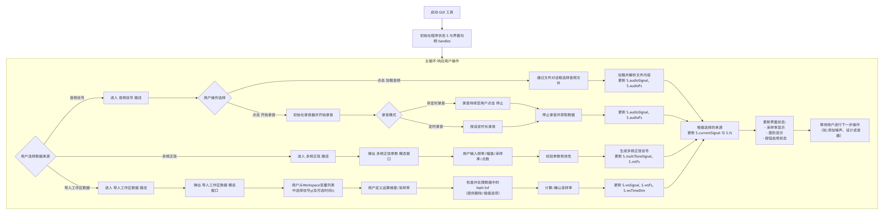
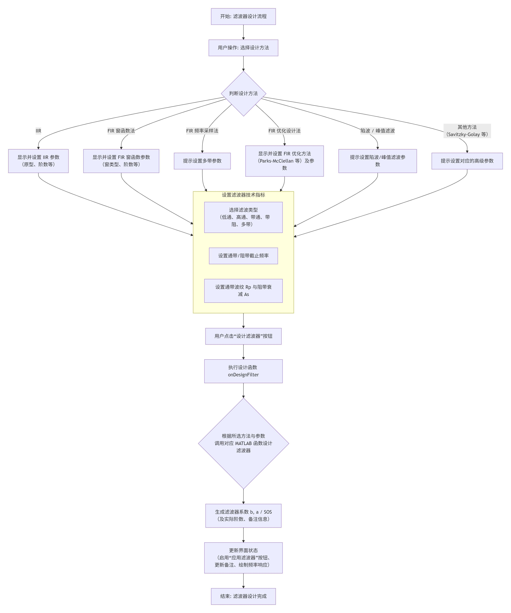
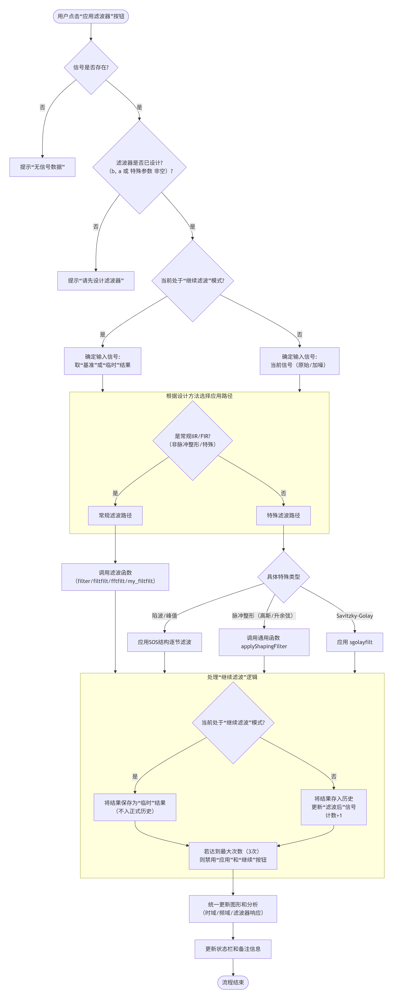
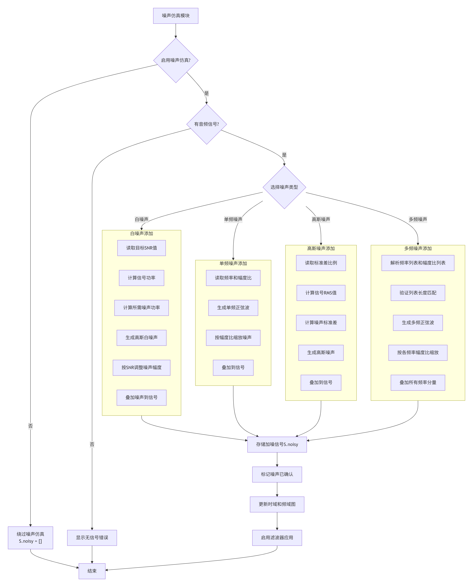
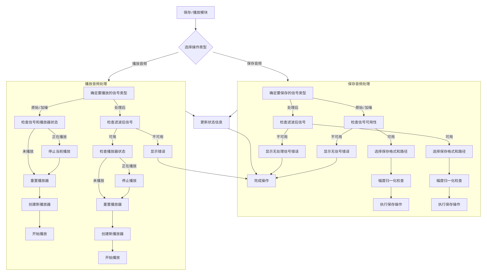
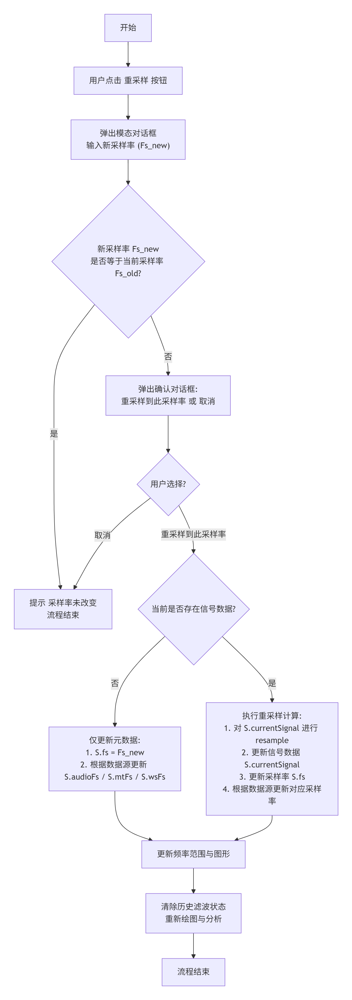

# 数字滤波器设计与应用GUI工具 - 说明文档 

## 目录

1. [工具概述](#一、工具概述)
2. [功能特性](#二、功能特性)
3. [环境与依赖](#三、环境与依赖)
4. [快速开始](#四、快速开始)
6. [详细使用介绍](#五、详细使用介绍)
   - [界面布局总览](# 5.1 界面布局总览)
   - [数据 I/O 详解](# 5.2 数据 I/O 详解)
   - [滤波器设计详解](# 5.3 滤波器设计详解)
   - [噪声仿真详解](# 5.4 噪声仿真详解)
   - [可视化与比较](# 5.5 可视化与比较)
   - [继续滤波（Continue Filter）](# 5.6 继续滤波（Continue Filter）)
   - [按钮状态与工作流（设计/应用/继续/保存）](# 5.7 按钮状态与工作流（设计/应用/继续/保存）)
   - [滤波器技术指标对比（onFilterMetrics）](# 5.8 滤波器技术指标对比（onFilterMetrics）)
   - [其他功能](# 5.9 其他功能)
   - [性能与限制](# 5.10 性能与限制)
7. [文件结构与代码解析](#六、文件结构与代码解析)
8. [程序流程图](#七、程序流程图 )
9. [常见问题（FAQ）](#八、常见问题（FAQ）)


------

## 一、工具概述

`Audio_DSP_GUI`是一个MATLAB图形用户界面（GUI）程序。可用于数字滤波器的设计与应用，对音频等信号进行滤波。

------

##  二、功能特性

### 2.1 **多信号源支持**

- **音频信号**：支持从麦克风`录制`或从文件`加载`（.wav, .mp3, .flac, .m4a）音频。
- **多频正弦信号**：可自定义生成包含多个特定频率、特定幅度的合成信号，用于测试。
- **导入工作区数据**：可以导入MATLAB工作区的信号。

### 2.2 **采样率管理**

- **分离采样率存储**：音频信号、多频正弦信号和导入工作区数据分别维护独立的采样率字段，避免相互干扰。
- **重采样**：通过"重采样"按钮进行采样率修改，提供确认对话框和抗混叠重采样。
- **实时更新**：采样率变化后自动更新频率限制和图形显示。

### 2.3 **噪声仿真**

- **白噪声**：按目标信噪比（SNR）添加。
- **单频噪声**：添加一个特定频率和幅度的正弦波干扰。
- **高斯噪声**：按标准差比例添加随机噪声。
- **多频噪声**：添加多个频率的干扰，每个频率可单独设置幅度。
- **可混合叠加**：可以同时勾选多种噪声类型，组合叠加。

### 2.4 **滤波器设计**

- **IIR滤波器（递归式）**
  - **支持原型**：Butterworth（巴特沃斯）、Chebyshev Type I（切比雪夫I型）、Chebyshev Type II（切比雪夫II型）、Elliptic（椭圆滤波器）、Yule-Walker、maxflat（最大平坦IIR 滤波器）。
  - **阶数策略**：Butterworth、Chebyshev I、Chebyshev II和Elliptic支持`自动计算最小阶数`（在IIR阶数输入框输入0或负数）或`自定义阶数`（在IIR阶数输入框输入正整数）。Yule-Walker、maxflat `不支持自动计算最小阶数`。
  - **静态阈值**：自动计算得到的最小阶数限制。报错阈值：60。
  - **高阶稳定性处理**：当IIR阶数过高时自动提示并支持SOS（二阶节）结构转换。
- **FIR滤波器（非递归式）**
  - **窗函数法**：提供Hamming（汉明窗）、Hann（汉宁窗）、Blackman（布莱克曼窗）、Rectangular（矩形窗）、Kaiser（凯塞窗）选择。
  - **优化设计法**：提供Parks-McClellan（等效纹波）、cfirpm（Parks-McClellan的通用化扩展）、最小二乘（firls）、约束最小二乘（fircls）、约束最小二乘1（fircls1）方法。
  - **FIR 频率采样法（fir2）**：使用 MATLAB 的 `fir2` 函数通过频率-幅值采样并做线性插值，然后做 IFFT + 窗函数得到滤波器系数。适合快速从指定的“幅值响应采样点”构建 FIR 滤波器，支持多带（multi-band）配置。
  - **阶数策略**：支持`自定义阶数`（在FIR阶数输入框输入正整数）。特别的，Kaiser（凯塞窗）、Parks-McClellan（等效纹波）支持`自动计算最小阶数`（在FIR阶数输入框输入0或负数）。
  - **静态阈值**：自动计算得到的最小阶数限制。对于Kaiser（凯塞窗），报错阈值：2000。对于Parks-McClellan（等效纹波），警告阈值： warning_threshold = 1400；报错阈值：error_threshold = 2000。
- **常规滤波参数体系**
  - **滤波类型**：低通、高通、带通、带阻。
  - **通带/阻带边界**：独立设置通带截止频率（fp1, fp2）和阻带截止频率（fs1, fs2）。
  - **通带波纹/阻带衰减**：设置Rp（通带最大衰减）和Rs（阻带最小衰减）参数。
  - **参数调整**：检测并修正不合理的频率关系，提供提示。
  - **交互式调节**：频率参数配有滑动条和数值输入框，可联动。

- **陷波/峰值滤波（谐振器）**：

  - 陷波/峰值滤波通过“陷波 / 峰值滤波参数”按钮设置参数，后续可考虑将“陷波 / 峰值滤波参数”按钮纳入到“多带/高级滤波参数”按钮。
  - 支持`单频率`,`多频率`,`梳状` 陷波/峰值滤波

- **多带/高级滤波**

  - IIR - Yule-Walker、IIR - maxflat、FIR 优化设计法、FIR频率采样法通过选择“多带/高级”滤波类型然后通过“多带/高级滤波参数”按钮设置多带参数。

  - FIRintfilt插值、FIRgaussdesign脉冲整形、FIRrcosdesign脉冲整形、Savitzky-Golay通过选择“多带/高级”滤波类型然后通过“多带/高级滤波参数”按钮设置参数。

### 2.5 **可视化与分析**

- **多图联动的绘图区域**：
  - 原始/加噪信号的`时域波形`和`频谱图`。
  - 滤波后信号的`时域波形`和`频谱图`。
  - 设计滤波器的`幅频响应特性`和`相频响应特性`。
- **绘图参数**：支持`plot`（连续线）和`stem`（离散点）两种绘图模式；。
- **综合比较图弹窗**：在一个独立窗口中以2x2布局同时显示`原始vs滤波`、`加噪vs滤波`的时域和频域对比，用于效果评估。
- **窗口重用**：比较窗口可重复使用，避免窗口堆积。

### 2.6 **音频操作流程**

- **播放功能**：可试听`原始/加噪`信号和`滤波后`信号，带自动幅度归一化。
- **保存功能**：
  - `保存处理后音频`：保存滤波后的结果。
  - `保存非加载音频`：判断并保存`录制的`、`生成的（多频正弦）`、`加噪后的`或者`从工作区导入的数据`音频。
  - **多格式支持**：支持保存为.wav, .mp3, .flac, .m4a格式。
- **保存图像**：将界面中波形图、频谱图、滤波器响应图等保存为PNG文件。支持保存所有图像与部分需要的图像。


------

## 三、环境与依赖

### 3.1 必要条件

1. **软件**：**MATLAB** （程序基于 R2025b 开发测试，使用本程序时推荐 R2024b 或更高版本） 。程序大量使用了Modern UI组件（如`uigridlayout`），这些组件在旧版本中可能不可用。
2. **MATLAB工具包**：
   - `Signal Processing Toolbox`（提供`butter`, `cheby1`, `cheby2`, `ellip`,`yulewalk`,`maxflat`, `fir1`, `fir2`,`firpm`, `cfirpm`,`firls`,`fircls`,`fircls1`,`intfilt`,`gaussdesign`,`rcosdesign`,`sgolay`,`freqz`等核心函数）。
   - `Audio Toolbox`（提供`audioplayer`, `audiorecorder`, `audioread`, `audiowrite`等音频I/O函数）。
   - （通常MATLAB主安装会包含这些基础工具包）

### 3.2 安装与部署

1. **获取代码**：将`Audio_DSP_GUI.m`、`DSPState.m`、`GUIHandles.m`、`firpm_fresp_example.m`、`cfirpm_fresp_example.m`、`firchk_local.m`、`README.md`文件及`matlab_prism_offline`、`assets`文件夹保存到您的MATLAB工作路径或您选择的文件夹中。

2. **启动MATLAB**：打开MATLAB软件。

3. **运行程序**：在MATLAB的`命令行窗口`（Command Window）中，键入文件名并回车：

   ```
   Audio_DSP_GUI
   ```

   按下回车后，GUI界面将会启动并显示在屏幕上。
   
   

------

## 四、快速开始

1. **启动GUI**：
   - 将`Audio_DSP_GUI.m`、`DSPState.m`、`GUIHandles.m`、`firpm_fresp_example.m`、`cfirpm_fresp_example.m`、`firchk_local.m`、`README.md`文件及`matlab_prism_offline`、`assets`文件夹放在同一文件夹中（帮助按钮会打开本 README）。  
   - 在MATLAB命令窗口输入 `Audio_DSP_GUI`并回车。
2. **加载一个示例音频**（如果您没有，可以跳过直接看第3步）：
   - 在`数据 I/O`面板，确保`数据来源`是`音频信号`。
   - 点击`加载音频`按钮，选择一个您的`.wav`或`.mp3`文件。
3. **（可选）录制或生成信号**：
   - **录制**：点击`开始录音`，对着麦克风说话，然后点击`停止录音`。
   - **生成**：在`数据来源`下拉菜单选择`多频正弦`，然后点击`生成多频正弦`。
4. **（可选）修改采样率**：
   - 除某些场景外，通常不必为"纯粹的数字滤波器设计"对原始信号做重采样
   - 如果需要改变采样率，点击`重采样`按钮，输入新采样率并确认重采样。
5. **（可选）添加一点噪声**（体验降噪）：
   - 在`噪声仿真`面板，勾选`启用噪声仿真`。
   - 勾选`白噪声`，将`目标SNR`设为`10`dB（模拟嘈杂环境）。
   - 点击`确定`按钮。您会看到`原始/加噪：时域波形`图中多了一条虚线（加噪声后的信号）。
6. **设计一个滤波器**：
   - 在`滤波器设计`面板，方法选`IIR`，原型选`Butterworth`。
   - 在`截止频率`面板，类型选`带通`。
   - 设置`通带截止fp1`为`300`Hz，`通带截止fp2`为`3400`Hz（这是语音的主要频率范围）。
   - 点击`设计滤波器`按钮。右侧会显示出滤波器的频率响应曲线。
7. **应用并试听效果**：
   - 点击`应用滤波器`按钮。绘图区会显示出处理后的信号波形和频谱。
   - 点击`播放原始/加噪`试听带噪的声音。
   - 点击`播放处理后音频`试听滤波后的干净声音，您应该会听到噪音被有削减。
8. **查看滤波器指标是否符合预期**：
   - 点击`滤波器指标`按钮。会弹出`滤波器技术指标对比`窗口。可以查看滤波器技术指标的`设定值`与`实际值`。

9. **（可选）继续滤波**：
   - 点击`继续滤波`按钮，可以进行链式滤波，即将上次滤波的数据作为新的待滤波数据。

10. **保存您的成果**：
   - 点击`保存处理后音频`，选择一个格式（如.mp3）和文件名即可保存。
   - 点击`保存图像`按钮，可以选择将`原始/加噪时域`、`原始/加噪频域`、`处理后时域`、`处理后频域`、`滤波器幅频和相频`、`滤波前后对比图`、`滤波器群延迟`、`滤波器相位延迟`、`滤波器单位冲激响应`、`滤波器单位阶跃响应`、`滤波器零极点图`等保存到指定文件夹。


------

## 五、详细使用介绍

### 5.1 界面布局总览

GUI主窗口采用网格布局，分为三大区域：

- **左侧面板**：所有参数设置和操作控件，按功能分组在多个子面板中。
- **右侧区域**：图形显示，分为6个子图，用于可视化信号和滤波器特性。
- **底部区域**：备注信息面板、说明文档。

### 5.2 数据 I/O 详解

1. #### 数据来源管理

   - **音频信号模式**：
     - `加载音频`：支持多种格式（.wav, .mp3, .flac, .m4a），自动处理多声道音频。
     - `开始录音`/`停止录音`：集成录音功能，支持定时和非定时两种模式。
     - 采样率显示为只读文本，通过`重采样`按钮修改。
   - **多频正弦模式**：
     - `预设的多频测试信号`：频率列表 = [300, 600, 1000, 3000]，幅值列表= [1, 0.8, 0.6, 0.4];
     
     - `MT采样率(Hz)`：生成信号的采样率（100-192000 Hz）。
     
     - `MT采样数(N)`：信号长度（100-10,000,000点）。
     
     - `生成多频正弦`：创建预设的多频测试信号。
   - **导入工作区数据**：
     - 当选择`导入工作区数据`时，程序会从MATLAB base workspace（工作区）中加载用户指定的时间向量`t`（若选择时间向量来计算采样率）和信号`y`作为数据源。
     - **操作流程**：
       1. 点击`数据来源`下拉菜单，选择`导入工作区数据`
       2. 点击`导入工作区数据`按钮，弹出变量选择对话框
       3. 在对话框中：
          - 若选择时间向量来计算采样率：选择时间向量（单位秒），选择信号向量（向量 | 矩阵 | N维数组）。点击`确认`后，程序自动计算采样率`S.wsFs = round(1/median(diff(t)))`。
          - 若指定采样率：选择信号向量（向量 | 矩阵 | N维数组）。
          - 沿信号运算的维度：需要确定您的信号是按哪个维度进行存储的，例如，N x Channels 音频信号（矩阵），指定沿信号运算的维度为 1，Channels 表示通道数，N 表示每通道的样本数。
       5. 数据加载后自动绘制波形图，此时其他数据源控件（录音/生成/音频加载）将被禁用
   
2. #### 采样率控制

   1. **分离存储**：音频信号源、多频正弦信号源、工作区导入的数据信号源分别维护独立的采样率字段，避免相互干扰。

   2. **采样率修改**：采样率不能直接编辑，须通过`重采样`按钮进行修改，若当前无信号数据，可通过`重采样`修改预置的采样率（44100）。

   3. **确认机制**：修改采样率时会弹出确认对话框，提供"重采样到此采样率"和"取消"选项。

   4. **抗混叠重采样**：使用MATLAB的`resample`函数进行带抗混叠重采样。

   5. **数据同步**：重采样会同步处理当前信号数据、加噪信号数据。

    **重采样使用场景**：

	- 将高采样率音频降采样以减少计算量
	- 统一不同来源信号的采样率
	- 匹配目标系统的采样率要求

3. #### 录音模式

	- **非定时录音**：点击`开始录音`开始，点击`停止录音`结束，时长自由控制。
	- **定时录音**：设置好`录音时长 (s)`，点击`开始录音`后，程序会自动录制指定时长后停止。

4. #### 保存非加载音频

	此按钮会根据当前状态动态改变其功能和文本：

	- `保存录制的音频`：如果您通过麦克风录制了音频。
	- `保存生成的信号`：如果您生成了多频正弦信号。
	- `保存加噪后的音频`：如果您启用了噪声仿真并点击了`确定`按钮。
	- `导入工作区数据`：如果您从工作区导入了数据。

### 5.3 滤波器设计详解

1. #### 设计方法选择

    - **IIR**：
    
      - **优点**：阶数低，计算效率高，能达到的衰减大。
      - **缺点**：非线性相位，可能不稳定。
      - **选择指南**：追求高效、实时处理时选用。
    - **FIR窗函数法**：
    
      - **优点**：总是稳定，可实现线性相位。
      - **缺点**：阶数通常很高，计算量大。
      - **选择指南**：需要保持波形形状（线性相位）时选用。
    - **FIR频率采样法**：
    
      - **优点**：直观、能允许任意频率-幅值曲线采样、支持多带与可选插值细化（npt/lap）；实现简单。
      - **缺点**：对 `f`/`m` 的离散点依赖性较强，若采样点过稀可能产生不理想的频率响应；需要注意窗向量长度（必须为 n+1）。
    - **FIR优化设计法**：
    
      - **优点**：在给定阶数下性能最优（如最窄过渡带）。
      - **缺点**：设计算法更复杂。
      - **选择指南**：对滤波器性能有极致要求时选用。
    
    - **陷波/峰值滤波**：
    
      - **陷波**：其阻带极窄，旨在滤除（陷落）某一个或几个特定的离散频率点的干扰，同时尽可能少地影响其他频率成分。它常用于消除已知的固定频率噪声，如电源工频干扰（50Hz/60Hz）。
      - **峰值滤波（谐振）**：其通带极窄，旨在选择性地增强（提升）某一个或几个特定的离散频率点的信号成分。它常用于音频均衡、谐振频率的提取或增强。
    
    - **intfilt（插值滤波器）**：
    
      - **功能**：设计用于插值或抗混叠（抽取） 的线性相位 FIR 滤波器。
    
      - **核心参数**：插值因子 r、滤波器阶数 n和带宽 b（通常为 1/r）。
    
      - **设计目标**：在插值后，保留原始信号的全部信息（通带平坦），并强烈抑制由插值引起的镜像频率成分。
    
      - **选择指南**：当您需要执行整数倍上采样（插值）或下采样（抽取） 时，这是首选工具。它生成的滤波器系数可直接用于 upfirdn等函数。
    
    - **gaussdesign（高斯滤波器）**：
    
      - **功能**：设计具有高斯频率响应的 FIR 滤波器。
    
      - **核心特性**：其时域脉冲响应和频域传输函数都具有高斯函数形状，没有过冲。这使其具有最小的群延迟波动和恒定的群延迟，是近似线性相位的一种优秀选择。
    
      - **关键参数**：bt（带宽-时间积）乘积，它决定了滤波器的陡峭程度。bt越小，滤波器越窄，过渡带越陡；bt越大，滤波器越宽，过渡带越缓。
    
      - **选择指南**：适用于需要最小脉冲展宽和平滑衰减的应用，例如在通信系统中用于脉冲整形，或在测量系统中希望保持脉冲波形形状时。
    
    - **rcosdesign（升余弦滤波器）**：
    
      - **功能**：设计升余弦（包括根升余弦）FIR 脉冲整形滤波器。
    
      - **核心特性**：通过滚降因子 alpha在码间串扰（ISI） 和带宽占用之间进行权衡。alpha=0时最陡峭但带宽最小，易受定时误差影响；alpha=1时最平滑但带宽加倍。
    
      - **选择指南**：数字通信系统（如调制解调）中的标准脉冲整形器。发送端和接收端通常各使用一个根升余弦滤波器（shape='sqrt'），组合效果实现无码间串扰的升余弦滤波。
    
    - **sgolay（Savitzky-Golay 滤波器）**：
    
      - **功能**：设计 Savitzky-Golay 平滑滤波器，本质是一种局部多项式最小二乘拟合器。
    
      - **核心原理**：它通过滑动窗口，在窗口内用多项式拟合数据点，并用拟合出的中心点值替代原始值。这种方法在平滑噪声的同时，能更好地保留信号的局部特征（如峰值、宽度）。
    
      - **关键参数**：多项式阶数 k和帧长（窗口长度） f。阶数越低越平滑，阶数越高越能保留细节；窗口越长越平滑，但边缘失真越严重。
    
      - **选择指南**：适用于需要从噪声数据中提取趋势或保持光谱/色谱峰形的场景，如化学分析信号处理、生物信号处理、经济学数据平滑等。


2. #### IIR 原型说明

| 原型             | 特点                                                         | 滤波器阶数和截止频率计算函数                                 | 滤波器设计函数                                               | 滤波器设计函数需要的参数                                     | 适用场景                                                     |
| ---------------- | ------------------------------------------------------------ | ------------------------------------------------------------ | ------------------------------------------------------------ | ------------------------------------------------------------ | ------------------------------------------------------------ |
| **Butterworth**  | 通带最平坦                                                   | [n,Wn] = buttord(Wp,Ws,Rp,Rs)（截止频率`Wn`是滤波器的归一化增益为 **-3 dB** 处的频率。此处的`Wn`与`FIR 窗函数`的`Wn`不同） | [b,a] = butter(n,Wn,ftype)（截止频率`Wn`是滤波器的归一化增益为 **-3 dB** 处的频率。此处的`Wn`与`FIR 窗函数`的`Wn`不同） | 阶数, fp1, fp2                                               | 一般用途，要求通带平滑                                       |
| **Chebyshev I**  | 通带等波纹，过渡带更窄                                       | [n,Wp] = cheb1ord(Wp,Ws,Rp,Rs)                               | [b,a] = cheby1(n,Rp,Wp,fType)                                | 阶数, **Rp**, fp1, fp2                                       | 允许通带微小波动，换取更陡的过渡带                           |
| **Chebyshev II** | 阻带等波纹                                                   | [n,Ws] = cheb2ord(Wp,Ws,Rp,Rs)                               | [b,a] = cheby2(n,Rs,Ws,fType)                                | 阶数, **Rs**, fs1, fs2                                       | 要求阻带衰减均匀                                             |
| **Elliptic**     | 通带&阻带均为等波纹，过渡带最窄                              | [n,Wn] = ellipord(Wp,Ws,Rp,Rs)（此处的`Wn`是**通带边缘频率**，相当于Wp，指定为标量或二元素向量。通带边缘频率是滤波器幅值响应为 -`Rp`时的频率。此处的`Wn`与`butter`、`FIR 窗函数`的`Wn`不同） | [b,a] = ellip(n,Rp,Rs,Wp,fType)                              | 阶数, **Rp**, **Rs**, fp1, fp2                               | 性能要求极高，允许通带阻带均有波纹                           |
| **maxflat**      | 可独立控制分子和分母阶数的广义Butterworth滤波器，在-3dB点处具有最大平坦幅度特性 | 无需单独计算阶数和截止频率，设计时直接指定参数               | 1. [b,a] = maxflat(n,m,Wn)（IIR形式） 2. b = maxflat(n,'sym',Wn)（FIR对称形式） 3. [b,a,b1,b2,sos,g] = maxflat(n,m,Wn,designflag) | 1. 分子阶数n，分母阶数m，归一化截止频率Wn 2. 分子阶数n（必须为偶数），'sym'标志，归一化截止频率Wn 3. 附加参数designflag可控制设计显示（'trace'/'plots'/'both'） | 1. 需要精确控制通带平坦度和过渡带陡度的特殊应用 2. 需要独立控制分子/分母阶数的广义Butterworth滤波器设计 3. 需要最大平坦群延迟特性的应用 4. 需要对称FIR Butterworth滤波器的应用 |
| **Yule-Walker**  | 基于指定频率响应的IIR滤波器设计，采用自回归模型，适用于任意频率响应形状 | 无需单独计算阶数和截止频率，设计时直接指定目标频率响应       | [b,a] = yulewalk(n, f, m)                                    | 滤波器阶数 n, 归一化频率向量 f, 对应的期望幅值向量 m         | 需要匹配任意给定频率响应形状的应用，如音频均衡、特殊频谱成形等 |


3. #### FIR 窗函数说明

| 窗函数          | 主瓣宽度               | 旁瓣峰值衰减                 | 滤波器阶数和截止频率计算函数 | 滤波器设计函数          | 滤波器设计函数参数说明（此处的`Wn`与`butter`的`Wn`不同） | 特点                                                                                     |
| --------------- | ---------------------- | ---------------------------- | ------------------------------------------------------------------------------------------ | ------------------------------------------------------------------------------------------ | ------------------------------------------------------------------------------------------ | ------------------------------------------------------------------------------------------ |
| **Rectwin** | 最窄                   | -13 dB                       | -  | b = fir1(n,Wn,ftype)   | 截止频率`Wn` 是滤波器的归一化增益为 **-6 dB** 处的频率 | 旁瓣高，频谱泄漏严重，过渡带最窄但阻带衰减差                                             |
| **Triang** | 适中 | -25 dB | - | b = fir1(n,Wn,ftype) | 截止频率`Wn` 是滤波器的归一化增益为 **-6 dB** 处的频率 | 是矩形窗和汉宁窗之间的折中选择 |
| **Hanning**     | 适中                 | -31 dB                       | -  | b = fir1(n,Wn,ftype)   | 截止频率`Wn` 是滤波器的归一化增益为 **-6 dB** 处的频率 | 较好的平衡，常用于频谱分析                                                               |
| **Hamming**     | 适中                   | -41 dB                       | -  | b = fir1(n,Wn,ftype)   | 截止频率`Wn` 是滤波器的归一化增益为 **-6 dB** 处的频率 | 较好的平衡，常用的折中选择                                                               |
| **Blackman**    | 最宽                   | -57 dB                       | -  | b = fir1(n,Wn,ftype)   | 截止频率`Wn` 是滤波器的归一化增益为 **-6 dB** 处的频率 | 旁瓣最低，阻带衰减好，但过渡带最宽                                                       |
| **Kaiser**      | 可变（随β增大而增加）  | 可调（随β增大而提高，约-13dB至-80dB+） | [n,Wn,beta,ftype] = kaiserord(f,a,dev,fs) | b = fir1(n,Wn,ftype) | 截止频率`Wn` （两个函数的Wn都是）是滤波器的归一化增益为 **-6 dB** 处的频率 | 核心优势为参数化可调：通过调整参数β（形状因子）灵活平衡主瓣宽度（频率分辨率）与旁瓣衰减（频谱泄漏）；β=0时退化为矩形窗，β增大时主瓣变宽但旁瓣衰减显著提升，适用于需根据具体需求优化性能的场景（如数字滤波器设计、高分辨率频谱分析）。 |


4. #### FIR频率采样法说明

    - **简介**：使用 MATLAB 的 `fir2` 函数通过频率-幅值采样并做线性插值，然后做 IFFT + 窗函数得到滤波器系数。适合快速从指定的“幅值响应采样点”构建 FIR 滤波器，支持多带（multi-band）配置。
    
    - **函数原型（常用）**：
    
      ```matlab
      b = fir2(n, f, m)                % 基本用法（f 已归一化到 [0,1]，1 对应 Nyquist）
      b = fir2(n, f, m, npt, lap)      % 指定插值网格点数 npt 与重复点附近插入区域长度 lap
      b = fir2(n, f, m, npt, lap, win) % 指定 window 向量（长度 n+1），例如 kaiser(n+1,beta)
      ```
    
    - **GUI 支持**：
    
      - 在“滤波器设计”子面板的 **设计方法** 下拉中新增“FIR频率采样法”选项；选择后仅需设置 `FIR 阶数`（`n`），其它多带参数通过“多带参数设置”模态窗口配置。
      
    - **优缺点**：
    
      - 优点：直观、能允许任意频率-幅值曲线采样、支持多带与可选插值细化（npt/lap）；实现简单。
      - 缺点：对 `f`/`m` 的离散点依赖性较强，若采样点过稀可能产生不理想的频率响应；需要注意窗向量长度（必须为 n+1）。
      
      
    
4. #### FIR 优化设计法说明

| **维度**                         | **Parks-McClellan（等波纹法）**                              | **最小二乘法（firls）**                                      | **约束最小二乘法（fircls）**                                 | **约束最小二乘法1（fircls1）**                               | **复 FIR Parks-McClellan（cfirpm）**                         |
| -------------------------------- | ------------------------------------------------------------ | ------------------------------------------------------------ | ------------------------------------------------------------ | ------------------------------------------------------------ | ------------------------------------------------------------ |
| **滤波器阶数和截止频率计算函数** | [n,fo,ao,w] = firpmord(f,a,dev,fs)                           | -                                                            | -                                                            | -                                                            | -                                                            |
| **滤波器设计函数**               | b = firpm(n,f,a,w)                                           | b = firls(n,f,a,w)                                           | b = fircls(n,f,amp,up,lo)                                    | b = fircls1(n, wo, dp, ds) b = fircls1(n, wo, dp, ds, wt) b = fircls1(n, wo, dp, ds, wp, ws, k) b = fircls1(_, "high") b = fircls1(_, designDisplay) | b = cfirpm(n, f, a, w)                                       |
| **滤波器设计函数参数说明**       | `f`表示**滤波器幅度响应的分段频率边界**，而非直接对应增益下降到特定dB值的频率点 | `f`表示**滤波器幅度响应的分段频率边界**，而非直接对应增益下降到特定dB值的频率点 | `f`表示**滤波器幅度响应的分段频率边界**，而非直接对应增益下降到特定dB值的频率点 | `n`：滤波器阶数 `wo`：归一化截止频率 (0到1，1对应奈奎斯特频率) `dp`：通带最大纹波（相对于1的最大偏差） `ds`：阻带最大纹波（相对于0的最大偏差） `wt`：指定频带边缘频率以满足特定要求 `wp, ws, k`：定义L2加权函数的边缘频率和误差比 `"high"`：设计高通滤波器（自动使用偶数阶） | `n`：滤波器阶数 `f`：归一化频带边缘向量 (-1 到 1) `a`：期望的**复频率响应**向量（可指定幅度和相位） `w`：各频带的加权向量 |
| **核心算法/准则**                | 基于**Remez交换算法**（迭代优化，求解切比雪夫逼近问题）      | 基于**加权最小二乘法**（L₂范数优化）                         | 基于**带约束的加权最小二乘法**（迭代优化，兼顾约束与L₂范数） | 基于**带约束的迭代最小二乘算法**。在**满足通带纹波≤dp、阻带纹波≤ds的约束条件下**，最小化平方误差积分。算法使用多重交换，结合拉格朗日乘数和Kuhn-Tucker条件。 | 基于**扩展的Remez交换算法**，适用于**复数域**的切比雪夫逼近问题。 |
| **优化目标**                     | 最小化**最大加权误差**（使通带/阻带的峰值误差相等且最小）    | 最小化**加权平方误差的积分**（整体误差能量最小）             | 在**通带/阻带最大误差≤阈值**的约束下，最小化加权平方误差积分 | 在**满足用户指定的通带和阻带最大纹波约束（dp, ds）的前提下**，最小化平方误差积分。可选地，可通过加权函数（wp, ws, k）调整不同频带的误差最小化权重。 | 最小化**复误差（期望响应与实际响应之差）的最大模**，实现复数域等波纹逼近。 |
| **误差特性**                     | 通带、阻带均为**等峰谷误差**（等波纹，Peak-to-Peak Ripple）  | 误差能量整体最小，**无等波纹保证**（误差分布均匀但可能有峰值过冲） | 通带/阻带波纹**有上限约束**，同时整体误差最小                | 通带和阻带纹波**严格限制在用户定义的边界（[1-dp, 1+dp] 和 [-ds, ds]）之内**。通过迭代算法寻求满足约束条件下的最小二乘解，其纹波特性不一定等波纹。 | 在复数域实现**等波纹**逼近，误差的**实部和虚部**均满足等波纹特性。 |
| **线性相位支持**                 | 支持（可设计1/2/3型线性相位FIR滤波器）                       | 支持（同左）                                                 | 支持（同左）                                                 | 支持设计**线性相位的低通和高通FIR滤波器**。                  | **不支持**传统意义上的线性相位（系数为实数的对称/反对称结构）。设计的是**复系数滤波器**，其相位响应可以是任意形状。 |
| **主要特点**                     | 1. 计算高效，收敛快； 2. 过渡带陡峭，选择性高； 3. 波纹可控（等幅） | 1. 整体误差小，对平均响应敏感； 2. 无峰值误差控制，可能出现局部过冲； 3. 设计结果更“平滑” | 1. 平衡了**峰值约束**与**整体优化**； 2. 避免firls的峰值过冲； 3. 灵活性高于等波纹法 | 1. **无需显式指定过渡带**，由截止频率隐式定义； 2. **直接控制通带和阻带的最大偏差**，指标直观； 3. 提供**迭代过程显示选项**（`designDisplay`）便于观察收敛； 4. 设计高通滤波器时，**自动确保奈奎斯特频率响应不为零**（使用偶数阶）。 | 1. **能够设计任意频率响应（包括复值）的FIR滤波器**，是firpm在复数域的泛化； 2. 使用灵活的多频带复值描述 (`f`, `a`)； 3. 支持非对称、非线性相位的滤波器设计； 4. 适用于标准实系数滤波器无法实现的特殊频率形状。 |
| **适用场景**                     | - 需要**高选择性**（窄过渡带）的滤波器（如窄带通信滤波器）； - 对**峰值波纹**有严格要求的场合（如频谱分析预处理） | - 对**整体误差能量**敏感的场景（如系统辨识、均衡器近似设计）； - 不强调峰值波纹的温和滤波需求 | - 需要**限制最大失真**同时优化整体性能的场合（如音频滤波器、医疗信号处理）； - 避免等波纹法的“强制波纹”带来的额外损耗 | - 设计指标直接给定为**通带/阻带最大纹波和截止频率**的低通或高通滤波器； - 需要**严格控制通带和阻带最大失真**的应用程序； - 对**过渡带形状没有苛刻要求**，或不确定过渡带如何设定的情况。 | - 需要**复系数滤波器**的应用（如单边带调制、解析信号生成）； - 需要**非线性相位**或**指定非标准相位响应**的滤波器； - 设计**差分器、希尔伯特变换器**等具有特殊复数频率响应的系统； - 逼近**任意给定的复频率响应**。 |


6. #### FIR intfilt插值滤波

**intfilt** **插值参数设置说明**（详细信息请参阅MATLAB帮助文档）：

- 上采样因子 l：样本数，指定为正整数标量。intfilt设计一个线性相位 FIR 滤波器，用于处理一个每 l个样本中插入了 l-1个连续零值的序列。
- 非零样本数 p：指定为正整数标量。intfilt设计一个线性相位 FIR 滤波器，该滤波器使用最近的 2*p个非零样本执行带限插值。
- 过渡带宽度的倒数 alpha：指定为标量。alpha与滤波器的过渡带宽成反比，并且也影响阻带中无关区域的宽度。指定 alpha允许您指定输入信号占用的奈奎斯特区间的比例。这对于要插值的信号是有益的，因为它允许您在不影响插值的情况下增加过渡带宽，并且对于给定的 l和 p能获得更好的阻带衰减。如果将 alpha设为 1，则假定信号占用整个奈奎斯特区间。将 alpha设为小于 1 的值，允许在阻带中存在无关区域。例如，如果输入占用一半奈奎斯特区间，则可将 alpha设为 0.5。
- 拉格朗日多项式的阶数 n：指定为正整数标量。该 FIR 滤波器对每 l个样本中插入了 l-1个连续零值的序列执行 n 阶拉格朗日多项式插值。如果 n和 l均为偶数，则设计的滤波器不是线性相位的。
- 输出滤波器系数 b: 以向量形式返回。b的元素是一个 FIR 滤波器的系数。如果指定了 alpha，则假设原始信号的带限为奈奎斯特频率的 alpha倍。
  b的长度为 2*l*p-1。 对于 n 阶拉格朗日多项式插值，当 n 为偶数时，b的长度为 (n+1)*l；当 n 为奇数时，长度为 (n+1)*l-1。
- 请选择插值方式并设置对应参数。带限插值需要设置 p, alpha；拉格朗日插值需要设置阶数。

**intfilt 插值参数校验**

- intfilt(l,p,alpha) 要求 l 与 p 为正整数，alpha 表示原始信号占用的 Nyquist 比例（>0 且通常 <=1）。MATLAB文档描述了这些输入和返回的滤波器长度公式（bandlimited：length = 2*l*p-1；Lagrange：length = (n+1)*l 或 (n+1)*l-1）。
- 如果设置的 p 或 n 太大，会产生非常长的 FIR（耗内存、耗时），应在 GUI 阶段警告或阻止。MATLAB文档给出了滤波器长度公式，据此计算并做防护。
- 对于 Lagrange，当 n 与 l 同为偶数时，滤波器不是线性相位（MATLAB文档有说明），明确提示并确认是否继续。

- 使用 isfinite 检查 NaN/Inf。避免传入异常数值导致下游报错或内存异常。

- 将 p/n/l 都做 round(...) 后再判定，保证它们为整数（并在 UI 中也用 RoundFractionalValues，但额外在代码里兜底）。

- 增加滤波器长度计算，并用两个阈值（warnLen、blockLen）分别给出“警告”与“阻断”行为，避免在 GUI 设置一组会导致超大矩阵的参数。

- 对 Lagrange 的 n 与 l 同为偶数情形弹出确认（因为这会导致非线性相位，MATLAB文档有提示）。

- 在 params 中保存 filterLength，便于 updateNote() 展示并帮助用户调参。

- 阈值设计的理由：

  - warnLen = 10001：经验值（10k taps）通常已经很长、计算/绘图/分组延迟都明显；提示用户确认可避免卡死。

  - blockLen = 1e6：一百万系数通常会导致内存浪费或直接 OOM；直接阻断更安全。

**intfilt 插值滤波器应用**

- **不用 mean(grpdelay(b))：**grpdelay 返回随频率变化的群时延数组，取平均值既不稳定也不一定等于滤波器的真正常数时延（当线性相位时理论延迟为 (N-1)/2）。所以优先用 filterLength 直接计算延迟，更可靠且简单。
- 在检测到**“非线性相位且用户选择补偿”**时会弹出三选对话框：**跳过补偿 / 强制补偿 / 取消操作**。若用户选择“强制补偿”，程序会尝试用滤波器的群时延信息来估算一个代表性的延迟（用中位数群时延，比均值更鲁棒），并按该延迟做样本级的移位补偿（并用零填充恢复长度）。同时会明确警告用户这可能引入相位/幅度失真，并记录提示。
  - **注意：**强制补偿只是折衷方案——对于真正非线性相位滤波器，简单的样本移位不能恢复线性相位，只能作为用户明确承担风险的快速手段。更稳妥的做法仍是：调整参数使滤波器成为线性相位，或在设计阶段避免 Lagrange 的 n/l 同偶组合。
- **保持原长度：**为了不改变后续流程长度期望（UI/播放/存储），补偿后用零填充尾部恢复原长度。
- **多声道支持：**filter 与 upsample 可以对矩阵按列工作，代码用列维操作（[rows,cols]）通用处理。


7. #### gaussdesign脉冲整形滤波

**gaussdesign脉冲整形滤波参数说明**（详细信息请参阅MATLAB帮助文档）：

- 3dB 带宽-符号时间乘积 bt：指定为正实数标量。3 dB 单边带宽的单位为赫兹，符号时间的单位为秒。bt 值越小，生成的脉冲宽度越大。
  - GSM / GMSK：推荐范围：0.2 – 0.4。常用默认：0.3（业界常用值，兼顾频谱紧凑性与可接受的时域扩展）。
  - GFSK / Bluetooth：推荐范围：0.4 – 0.6。常用默认：0.5。
  - 一般 CPM / 需要频谱效率的连续相位调制：推荐范围：0.2 – 0.5。典型选择：0.3 – 0.4 作为折衷。
  - 对时域尾长敏感的高速链路：推荐范围：0.5 – 1.0。常用默认：0.5（若要更短的脉冲尾，可增大到 0.7–1.0）。
  - 设计折中建议：推荐值：0.3 – 0.5；常用"折中默认"是 0.35 或 0.4。0.35–0.4 在频谱与时域之间常是较稳妥的折中选择，适合多数仿真与原型开发场景。
  - 与其它脉冲成型（如根升余弦 RRC）比较提醒：RRC/RC 使用的是 roll-off（α）参数而不是 BT；在需要与这些滤波器比较时应以系统带宽与符号率为准做等效评估，而不是直接用 BT 数值相互替代。
- 符号数量 span：指定为正整数标量，默认为3。
- 每符号采样数 sps：每个符号周期的采样数（过采样因子），指定为正整数标量。
- 输出FIR 滤波器系数 h：高斯脉冲整形滤波器的 FIR 系数，以行向量形式返回。系数经过归一化，使得标称通带增益始终为 1。
- 滤波器应用：发射端滤波会使用upfirdn(x, b, sps)对数据进行上采样和滤波；接收端滤波会使用upfirdn(r, b, 1, sps)接收的信号进行滤波和下采样以进行匹配滤波；常规滤波会根据选择使用filter/filtfilt/my_filtfilt进行滤波，但推荐优先使用filtfilt进行滤波，在短信号或 filtfilt 失败时回退 filter 并提示。
- 发射端滤波输出长度与裁切：上采样后用 upfirdn 滤波，会产生 d 个采样点的前置延迟，通常需要把输出前 d 个样点裁切（或在发送前 pad）以保证符号对齐。这里提供"保留原长""裁切延迟"两种方式。
- 接收端滤波自动对齐方式：接收端（rx）使用 upfirdn(x, b, 1, sps) 做滤波+下采样时，输出到符号采样点的符号级延迟 = d/sps（可能是非整数符号延迟），若需要精确符号对齐，需注意是否为整数；若为非整数则需额外的分数延迟补偿。这里提供"自动插值""分数延迟"两种方式。

**gaussdesign脉冲整形滤波参数校验**

- 复现 gaussdesign 的 validateattributes 行为。在 isfinite(btVal) && btVal > 0 等基础上补上 isscalar、isreal、~isnan 等判断，避免用户输入向量/复数等非法值绕过校验。
- 对 span 与 sps 强制为“正整数标量”检查。
- 保留并强化“sps*span 必须为偶数”的检查。这条是 gaussdesign 的必要条件（滤波器阶数必须为偶数）。
- 加入“最大滤波器长度”上限保护。防止用户设置极大 sps 与 span（比如 1e9），导致内存耗尽或 MATLAB 崩溃。
- 对极端 bt 值做提示/拦截。例如 bt 非常接近 0 或超大，会导致产生物理/数值上不合意义的脉冲或数值不稳。这里给出默认建议阈值（MIN_BT/MAX_BT），并以警告形式拒绝继续——避免用户误输入导致后续结果毫无意义。
- 增加对 sps < 2 的提示。若 sps = 1，仍然合法但极少用于过采样场景，提示用户确认即可（不强制拒绝）。
- 在 GUI 阶段尝试生成滤波器系数并 try/catch 保护。在确认按钮阶段调用 gaussdesign（或内部 gaussdesignImpl）一次，若出现数值/维度错误可马上反馈，避免用户在后续“设计/应用”流程中遇到难以调试的运行时崩溃。生成的系数也被写入 params.h 以供 updateNote() 或上层回显使用。


8. #### rcosdesign脉冲整形滤波

**rcosdesign 脉冲整形滤波参数说明**（详细信息请参阅MATLAB帮助文档）：

- 滚降因子 beta：指定为不大于 1 的非负实数标量值。滚降因子确定滤波器的多余的带宽。零滚降对应于矩形滤波器，单位滚降则对应于纯升余弦滤波器。β 常用区间（约 0.20–0.35）。
- 符号数量 span：指定为正整数标量。
- 每符号采样数 sps：每个符号的采样数（过采样因子），指定为正整数标量。
- 升余弦窗的形状 shape："sqrt" (默认) 、"normal"
- 输出FIR 滤波器系数 b：升余弦滤波器系数，以行向量形式返回。
- 滤波器应用：发射端滤波会使用upfirdn(x, b, sps)对数据进行上采样和滤波；接收端滤波会使用upfirdn(r, b, 1, sps)接收的信号进行滤波和下采样以进行匹配滤波；常规滤波会根据选择使用filter/filtfilt/my_filtfilt进行滤波，但推荐优先使用filtfilt进行滤波，在短信号或 filtfilt 失败时回退 filter 并提示。
- 发射端滤波输出长度与裁切：上采样后用 upfirdn 滤波，会产生 d 个采样点的前置延迟，通常需要把输出前 d 个样点裁切（或在发送前 pad）以保证符号对齐。这里提供"保留原长""裁切延迟"两种方式。
- 接收端滤波自动对齐方式：接收端（rx）使用 upfirdn(x, b, 1, sps) 做滤波+下采样时，输出到符号采样点的符号级延迟 = d/sps（可能是非整数符号延迟），若需要精确符号对齐，需注意是否为整数；若为非整数则需额外的分数延迟补偿。这里提供"自动插值""分数延迟"两种方式。

**rcosdesign 脉冲整形滤波参数校验**

- beta 在 [0,1] （ MATLAB文档要求），若不满足将报错。
- span 与 sps 要为正整数。
- filterOrder = sps*span 必须为整数 且为偶数（MATLAB文档说明）。对“为奇数”情形拒绝。
- 阻止过大参数（MAX_SINGLE, MAX_TAPS）：这些阈值不是 MathWorks 文档强制，但为 GUI 体验和防 OOM（内存不足）与长时间运行安全加的保守限制。


9. #### Savitzky-Golay滤波

**Savitzky-Golay 参数设置说明**（详细信息请参阅MATLAB帮助文档）：

- 多项式阶数 m：指定为非负整数。m的值必须小于 fl。如果 m = fl – 1，则设计的滤波器不产生平滑效果。
- 帧长度 fl：指定为正奇数。fl的值必须大于 m。
- （可选）加权向量 w：指定为实正向量；默认为ones(fl,1)。加权向量的长度与 fl相同，用于执行最小二乘最小化。
- 加权向量 w 支持自定义加权向量：可以输入和 帧长度fl 长度相同的数值向量（如 [1, 1, 1, 1...]，长度 = length(fl)）或表达式（如 hamming(fl)、chebwin(fl,10)）。加权向量 w 同时提供了一些预置的加权向量表达式，可以选择期望的加权向量表达式。
- 输出的时变 FIR 滤波器系数 b：指定为 fl行 × fl列的矩阵。在平滑滤波器实现中（例如 sgolayfilt），最后的 (fl-1)/2行（每一行都是一个 FIR 滤波器）应用于信号的启动瞬态阶段，而开头的 (fl-1)/2行应用于信号的结束瞬态阶段。中心行应用于信号的稳态部分。
- 输出微分滤波器矩阵 g：指定为一个矩阵。g的每一列都是一个阶数为 p-1的微分滤波器，其中 p是列索引。给定一个长度为 fl的信号 x，您可以使用公式 xp((fl+1)/2) = (factorial(p)) * g(:, p+1)'' * x来估计其中间值的第 p阶导数 xp。
- 滤波器应用：可选择 平滑滤波器 或 微分滤波器；微分滤波器需指定微分阶数 Diff_N。
- 短信号处理：用于“平滑滤波器”时信号长度小于fl的处理，有两种处理方式选择：端点镜像填充，局部最小二乘拟合。
- 输入“加权向量 w” 数值向量时，需要加方括号[]，使用半角逗号或空格分隔各元素，如 [1, 1, 1, 1...]，长度 = length(fl)。

**Savitzky-Golay 参数校验**

- m（多项式阶数）必须是非负整数，且 m < fl（等价于 fl > m）。
- fl（帧长度）必须是正奇数且 ≥ 3。
- 若 m == fl-1：允许但 弹出警告（因为这时滤波器不再平滑）。
- 若选择微分（diff），则 Diff_N（微分阶数）必须为整数且 0 ≤ Diff_N ≤ m（Savitzky-Golay 要求微分阶 ≤ 多项式阶）。
- 权重 w：长度必须等于 fl、所有元素实数且全部严格 > 0；支持表达式（例如 hamming(fl)），但 eval 包裹在 try/catch 中并尽量使用 evalin('base',...) 以避免在函数作用域中缺少变量的问题；若解析失败则给出明确错误信息。

**Savitzky-Golay 滤波器设计**

- 对 p_sgolay.w 做了长度与正定性（>0）检查，避免运行时 sgolay 内部出错或得到错误 G。
- 修正并统一微分核的缩放（dt = 1/S.fs，kernel = factorial(n)/(-dt)^n * G(:,n+1)），并在出错时给出提示。
- 在平滑分支仍只调用 sgolay(... )（nargout=1），节省计算（不计算 G）。在微分分支要求 G，所以用 [B,G] = sgolay(...)。   

**Savitzky-Golay 滤波器应用**

- 优先使用 handles.sgolay_Bmatrix / handles.sgolay_Gmatrix，如果缺失或尺寸异常，则“用相同的权重/参数重算”以保证一致性。

- 统一核缩放公式（与设计分支一致），确保 kernel 在设计与应用两端相同。

- 对所有潜在异常（缺 diff_N、diff_N 越界、采样率无效）都给出提示并中止应用。

- Savitzky-Golay **平滑滤波器部分**：

  - 使用 B 矩阵的中间行得到稳态滤波（steady = conv(x, B(m+1,:), 'same')）；

  - 用 B 的前 (fl-1)/2 行和最后 (fl-1)/2 行分别计算启动/终止瞬变（ybeg, yend），并把它们放回结果开头/结尾；

  - **不使用 filter / filtfilt / my_filtfilt**。

  - 对于信号长度小于fl的短信号，默认的 **端点填充（mirror padding）** —— 把信号镜像延伸到至少 fl，按 steady + ybeg + yend 流程计算后裁切回原长；兼顾与 sgolayfilt 行为的连贯性且效率高。

  - 对于信号长度小于fl的短信号，可选的 **局部最小二乘拟合（sliding local LS）** —— 对每个样点用它能访问到的局部窗（最多 fl）做多项式最小二乘拟合（最多阶 m），并在窗的中心点上求值；对短信号更“局部/鲁棒”，但计算耗时更高。
  
  

10. #### maxflat（广义巴特沃斯）的多带参数窗口行为说明

- **主要参数设置**：

  - 分子阶数 n：实正标量。

  - 分母阶数 m：实正标量。

  - 截止频率fn(Hz)：滤波器幅度响应等于 -3dB 处的截止频率，指定为 [0, Nyq] 范围内的标量，其中 Nyq 对应于奈奎斯特频率，代码中会把 fn 归一化。

  - 对称性约束sym：勾选此项则 maxflat 将返回一个对称 FIR 巴特沃斯滤波器的系数 b。若勾选此项，分子阶数 n必须为偶数；分母阶数 m 的设置将无效。

  - 滤波器设计显示选项 designflag：指定为下列值之一：

    - trace：以文本形式显示设计中使用的设计表格
    
    -   plots：绘制滤波器的幅度、群延迟、零点和极点图
    
    -   both：同时显示文本表格和图形


- **参数校验**：

  - **对 `sym` 模式的检查**
    - 若 `sym` 被选中，强制 `n` 为偶数。

    - 对称（`sym`）模式下强制 `n < 140`（与 MATLAB `maxflat` 原始代码一致）。
  
  - **对 `m`（分母阶数）整型验证**
  
    - 保证为非负整数（`round` + 浮点检测）。
  
  - **将 GUI 的截止频 `fn` 转成 `Wn_norm = fn / nyq` 并在 GUI 阶段验证**
  
    - `maxflat`/`my_maxflat` 接受的 `Wn` 在 `[0,1]`，1 对应 Nyquist（pi rad/sample）。GUI 里用户输入 Hz，需要映射并校验。
  
  - **引入 `spec_table` 计算并校验可行的截止区间**
  
      - 直接复用文件内的 `spec_table`，以获得与 `maxflat` 一模一样的 `wo_min/pi`、`wo_max/pi` 范围。
  
      - 使用与 `maxflat` 源码一致的容差 `SN = 1e-7` 来判定 `Wn` 是否落在某一行的可行区间。
  
      - 如果不满足，给出提示，包含允许的归一化区间与换算回 Hz 的范围（对高通还会解释互补映射的范围）。
  
  
    - **支持 my_maxflat 的 'high'（高通）选项的校验**
  
        - 在 GUI 中会尝试识别用户是选择“高通”还是“低通”：先尝试读取 `ddFilterType.Value`（常见实现），如果界面有 `cbHigh` 也会优先读取。
        
        -   若为高通，则按 `my_maxflat` 的实现将 Wn 映射为 `1 - Wn`，并用该值去和 `spec_table` 的范围比较（这是 `my_maxflat` 内部会做的事情）。
        
        
        -   若高通映射导致原始 Wn 在不允许区间，给出清晰解释（并把可接受的高通 `fn` 区间换算为 Hz）。
        
  - **保存 `params` 时加入 `maxflat_isHigh` 标志**
  - 为后续执行 `my_maxflat` 或保存配置时能明确表明用户是否希望“高通互补”行为。
  


11. #### yulewalk 的多带参数窗口行为说明

- **主要参数设置**：

  - 滤波器阶数 n：由 "IIR 阶数" 输入框设置，必须为正整数（已在主界面填写）。

  - 频率向量 f（Hz）：要求以 0 开始、以 Nyq 结束，按边界升序排列，允许重复点表示阶跃响应。

  - 幅值向量 m（线性，非 dB）：长度应等于 f 的长度，表示在对应频点的幅值（例如 通带=1 阻带=0）。

  - 示例：f = 0, 2205, 4410, 11025, 22050   m = 0, 0, 1, 1, 0

  - 输入各个参数向量时，不要加方括号[]，使用半角逗号或空格分隔。

- **参数保存**：通过校验后把参数以结构体保存到 `handles.yulewalkParams`（`f`以 Hz 存储；内部会在设计时对 `f` 做 `f/nyq` 归一化）。若用户点击“取消”，不保存任何变更。


12. #### fir2（FIR 频率采样法） 的多带参数窗口行为说明

- **主要参数设置**：
  - `n`（滤波器阶数）：从主面板“FIR 阶数”输入框（`edtFIROrder`）取得（阶数越高过渡带越陡）。注意：fir2 对于在 Nyquist 处存在通带的配置会强制用偶数阶（若用户输入奇数，fir2 在内部可能增加 1）。
  - `f`（频率向量，**以 Hz 输入**）：必须以 `0` 开始、以 Nyq（`Fs/2`）结束、按升序排列，允许重复频率点（表示幅值阶跃），示例占位提示会给出常用写法（半角逗号或空格分隔）。
  - `m`（幅值向量）：与 `f` 等长，包含每个采样点的目标幅值（例如 `0,0,1,1,0,0`）。
  - `npt`（插值网格点数，可选）：默认 `512`。**校验规则**：若设置，必须为正整数且 `npt > n/2`。
  - `lap`（重复频率点周围区域长度，可选）：只有当 `npt` 被选定时，`lap` 复选才可用并可设置（原因：fir2 要求 lap 与 npt 协同使用）。若 `lap` 被选中但 `npt` 未被选中，提交时会抛出错误并要求先设置 npt。
  - `window`（可选）：窗口可通过复选框启用，提供下拉选择：`Rectwin`, `Triang`, `Hann`, `Hamming`, `Blackman`, `Kaiser`。若不启用，fir2 使用 Hamming（等效不指定 window 情况）。
  - `Kaiser beta`（可选）：仅在 `window=Kaiser` 时有效。**行为规则**：
    - 如果用户 **不勾选** Kaiser beta，则程序使用 **默认 beta 值 0.5**（GUI 中的初始值，可在界面中调整该默认值）。
    - 如果用户勾选 Kaiser beta，则使用用户输入值（数值校验：非空且在合理数值范围内，例如 `[0,100]`）。
  
- **f 输入单位与归一化**：

  - 用户在窗口中以 **Hz** 输入 `f`，程序内会把 `f` 除以 `Nyq` 做归一化（`f_norm = f / Nyq`）再传给 `fir2`。

- **参数校验**：点击“确定”时做以下检查，失败时使用 `uialert_safe()` 提示用户并要求修正：

  - `f` 与 `m` 非空且长度相等；`f` 中所有元素在 `[0, Nyq]` 且严格非降（允许重复）；`f(1)==0` 且 `f(end)==Nyq`（数值容差允许很小误差）。

  - `length(f)` 与 `length(m)` 匹配；对于标准低/高/带通/带阻，`f` 的点数应满足成对出现（频带边界）等常规约束（与 FIR 优化法一致的规则）。

  - 若 `npt` 被选中：`npt` 是正整数且 `npt > n/2`（`n` 来自主面板的 `FIR 阶数`）；若不满足报错。

  - 若 `lap` 被选中但 `npt` 未被选中：拒绝并提示“先设置 npt”。

  - 若选择了 `window=Kaiser` 且勾选 Kaiser beta：`beta` 必须为数值且在合理范围内；若未勾选 Kaiser beta 则使用默认 beta（0.5）。

- **参数保存**：通过校验后把参数以结构体保存到 `handles.fir2Params`（`f`以 Hz 存储；内部会在设计时对 `f` 做 `f/nyq` 归一化）。若用户点击“取消”，不保存任何变更。

- **设计时调用**：当用户点击主界面的“设计滤波器”按钮且滤波类型为 “多带/高级” 时（且设计方法为 `FIR频率采样法`，程序会读取 `handles.fir2Params` 并按当前子方法调用 `fir2`（频率采样法）。出错或参数缺失时会弹窗并回退。


13. #### Parks-McClellan（FIR阶数输入框输入数值小于等于0时）的多带参数窗口行为说明

- **主要参数设置**：

  - 滤波器阶数n：由 FIR阶数 输入框设置（阶数越高，过渡带越陡峭），输入数值小于等于0时，将使用firpmord自动估阶。

  - 频率向量f：使用 Hz 输入，要求以 0 开始、以 Nyq 结束(满足设置惯性，程序中会将0,nyq去掉以符合firpmord输入参数要求)；按升序排列。

  - 例如：0, 1000, 1500, 3000, 4500, 22050(Nyq) 。它定义了三个频带：[0, 1000]，[1500, 3000]和 [4500, 22050]

  - 幅值向量a：定义每个频带的理想幅值，长度 = length(f)/2。

  - 例如：0, 1, 0 。它定义了三个频带的理想幅值：[0, 1000]为0，[1500, 3000]为1， [4500, 22050]为0

  - 权重向量w：控制每个频带的逼近精度。firpmord估阶时不使用此参数。

  - 最大允许偏差dev：与 a 的长度相同，元素范围在区间(0;1)内。firpmord()估阶函数会使用dev，当 FIR阶数 输入框数值小于等于0时(表示自动估阶)，dev将允许设置。

  - 例如：0.01, 0.001, 0.01 。 它定义了三个频带的最大允许偏差：[0, 1000]纹波为0.01，[1500, 3000]纹波为0.001， [4500, 22050]纹波为0.01

- **参数保存**：通过校验后把参数以结构体保存到 `handles.firpmParams`（`f`以 Hz 存储；内部会在设计时对 `f` 做 `f/nyq` 归一化）。若用户点击“取消”，不保存任何变更。


14. #### Parks-McClellan（FIR阶数输入框输入数值大于0时）的多带参数窗口行为说明

- **主要参数设置**：
  - **必须项**
    - **频率向量 f (Hz)**（以 Hz 输入）：定义频带边界（格式要求见下）。（对应 UI：`edtF`）。
    - **幅值向量 a**（或选用 **频率响应函数 fresp** 二选一）：幅值向量 `a` 对应 `f` 的采样（长度 = length(f)）；若选择 fresp，则必须先用“选择自定义频率响应函数”选择函数文件，并可选择性提供 `A`。（UI：`edtA`、`btnSelectFresp`、`chkFrespA`、`edtFrespA`）。
  - **可选项**
    - **权重向量 w**（每个频带一个权重，长度 = nbands = length(f)/2，UI：`chkW` + `edtW`）。
    - **频率网格密度 lgrid**（整数，建议 ≥16，UI：`chkLgrid` + `edtLgrid`）。
    - **奇对称设计选项（Odd symmetry）**：可选 `hilbert` 或 `differentiator`（UI：`chkOddSym` + `bgOddType`）；若选 `hilbert`，出现返回类型选择（`analytic` / `filtered`）。
    - **自定义 fresp 传参风格**：`pos` / `nv` / `both`，若选择 `nv` 或 `both` 且勾选 fresp-A，则 `paramName` 必填。
    - **输出选项**：`b` / `b, err` / `b, err, res`（UI 输出单选）。

> 默认状态：窗口打开时 `幅值 a` 被启用，`fresp` 选择控件初始禁用。用户在“输入参数选择”处切换时，界面会启/禁相关控件并显示/隐藏参数名输入区域。

- **参数校验**：

    - **FIR 阶数读取**
      - 从主窗口读取 `handles.edtFIROrder.Value`，四舍五入为整数 `firOrderVal`。必须为非负、有限的整数（`>= 0`）。若读取失败或不合法，弹窗并中止。
    - **频率向量 f 的校验**
      - `f` 必须是数值向量，且不包含 `NaN`/`Inf`。
      - 所有元素范围必须在 `[0, Nyq]`（Nyq = S.fs / 2）；并且 `f(1)` 精确为 `0`，`f(end)` 精确为 `Nyq`（内部使用 `1e-8` 或 `1e-6` 的容差），否则报错。
      - 元素必须**严格升序**（任何非递增都报错）。
      - `length(f)` 必须为 **偶数** 且 ≥ 4（即至少 2 个频带）；否则报错。
    - **频带边界/带宽**
      - 每个频带的起止必须满足 `f(2k) > f(2k-1)`，且至少一个频带宽度 > 0（避免全部退化）。
    - **幅值向量 a（若选用 a 模式）**
      - `a` 必须为实数向量、无 NaN/Inf，长度必须等于 `length(f)`（注意：在 UI 中长度提示/校验严格）。
    - **权重向量 w（若启用）**
      - `w` 的长度必须等于 `nbands = length(f)/2`，且元素为正的有限数值。
    - **lgrid**
      - 若勾选，`lgrid` 必须为整数，建议不小于 16（实现中会建议并校验 `lval < 16` 为非法）。
    - **奇对称（hilbert / differentiator）约束**
      - 如果选择 `hilbert` 或 `differentiator`，会检查 `a`（或 fresp.A）在 0 和 Nyq 的幅值是否接近 0，并在不符合期望时弹出警告/确认对话，要求用户确认或放弃（Differentiator 在 0 处通常期望幅值为 0；对 Nyq 也会给出提示）。如果用户取消，则中止。
    - **Nyquist 处非零增益与阶数约束（重要规则）**
      - 如果能够确定在 Nyq（`f(end)`）处的幅值为非零（从 `a` 或 `fresp.A` 或从 fresp 校验结果估计得到），则 **firpm 在 Nyq 处非零增益的情况下要求滤波器阶数 n 为偶数**。实现上：
        - 若 `mod(firOrderVal,2)==1`（奇数）且 `ampAtNyq != 0`，则弹出 `uiconfirm` 三选对话：**手动修改 / 自动增加并继续 / 取消**。
        - 选择“自动增加并继续”会将 `firOrderVal` 增加 1，更新 `handles.edtFIROrder.Value`，并继续设计；选择“手动修改”则提示用户回到主窗口修改；选择“取消”放弃。

    - **fresp 模式的严格校验**
      - 若用户选 fresp 模式并提供 fresp.A，且选择 Name-Value 或 Both 风格，`paramName` 必须填写且为合法 MATLAB 标识符（`isvarname` 校验）。否则报错。
        - 在 fresp 模式下，代码会调用 `validate_fresp_for_firpm(...)` 做更严格的交互式校验（要求该函数在路径上）。校验会产生 `report`（包含 `GF`/`DH`/`DW` 等），并把 `report` 保存到可查看的按钮 `btnShowFrespReport.UserData` 中，以便显示校验报告与绘图。若 `validate` 报错/返回不通过，UI 会提示并阻止继续。

- **参数保存**：通过校验后把参数以结构体保存到 `handles.firpmParams`（`f`以 Hz 存储；内部会在设计时对 `f` 做 `f/nyq` 归一化）。若用户点击“取消”，不保存任何变更。

    

15. #### cfirpm 的多带参数窗口行为说明

- **主要参数设置**：

  - **必须项**
    - **频率向量 `f` (Hz)**：以 Hz 输入，取值范围在 `[-Nyq, Nyq]`（`Nyq = Fs/2`），必须严格单调递增，元素个数**必须为偶数**。窗口占位提示例子与说明见顶部说明文本。
    - **幅值向量 `a` 或 频率响应函数 `fresp`（二选一）**：两种调用格式对应 `cfirpm` 的不同使用方式；UI 使用单选组选择“频率响应函数 fresp”或“幅值向量 a”。

  - **可选项**
    - **权重向量 `w`（每个频带一个权重）**：通过勾选 `cbW` 启用并在文本框输入。
    - **频率网格密度 `lgrid`**：作为可选项（checkbox + numeric field），若启用必须为正整数。
    - **对称性 `sym`**：`none` / `even` / `odd` / `real`（选择后需与频率向量兼容，见校验）。
    - **群延迟偏移 `d`（group delay）**：可选（checkbox + numeric）。在 `fresp` 模式下有效；可作为 `fresp` 的参数传入（Name-Value 或 Positional）。
    - **自定义 `fresp` 附加：** 当选择 `user_defined_function` 时，允许选择 `.m` 文件、可选传入幅值向量 `A`、并可选择传参风格（Name-Value / Positional / Both）与参数名。界面会动态显示相关控件。
    - **Hilbert / differentiator / invsinc 等特定 fresp 的额外参数**：界面会按内置 `fresp` 名称显示不同的额外输入（`multiband` 的 `amb`、`differentiator` 的采样率、`invsinc` 的增益、`hilbfilt` 的返回选项等）。
    - **调试 / skip_stage2 / 输出形式**：`debug` 模式、`skip_stage2` 复选、输出选项 `b` / `b, delta` / `b, delta, res` 都可配置。

- **参数校验**：

  - **频率向量 `f`**：必须为**数值向量**、有限、实数、无 `NaN`/`Inf`。长度 `>= 2` 且 **偶数**（`mod(numel(f),2)==0`）。严格单调递增（任意相邻差值需大于容差 `tol`）。元素范围严格位于 `[-Nyq, Nyq]`（有容差 `tol`）。
  - **幅值向量 `a`**：若选 `a` 模式，`a` 必须为数值向量，长度**等于 `length(f)`（或等于带数/节点数，根据内置说明）**，且为有限实数。

  - **权重向量 `w`**：若启用，`w` 必须为正的有限数值，长度等于**带数 `nbands = length(f)/2`**。且每元素 `>= minWeightVal`（实现中使用 `1e-10`）。

  - **`lgrid`**：若勾选必须是正整数（代码会 round 并校验 `>=1`）。建议不小于某阈值（UI 给出默认 25 或 16 的建议）。

  - **`sym`（对称性）与频率范围**：当选择 `sym`（`even`/`odd`/`real`）时，频带边界**必须**位于非负半域（`f_norm >= 0`）；若 `f` 包含负频率将报错并提示用户改动或把 `sym` 设为 `none`。这是 `cfirpm` 对对称性设计的要求。

  - **`group_delay d`**：如果勾选，`d` 必须为有限数值；当以 Name-Value 形式传给自定义 `fresp` 时，用户需填写合法参数名（`isvarname` 校验）。

  - **自定义 `fresp`（`user_defined_function`）的校验流程**：

    当用户选择自定义 `fresp` 并点击校验/确认时，实施如下流程（实现细节与异常处理见代码）：

    - **必须选择 `.m` 文件**（`userFrespFile`），并将其目录临时 `addpath`（失败则中止）。构造函数句柄 `fh = str2func(userBase)`。
    - **准备参数**：归一化频率 `f_norm = fvec/nyq`（范围 `[-1,1]`）；准备权重 `Warg`、可选 `A`、可选 `d`，根据用户选择的传参风格（Positional / Name-Value / Both）把它们放在 `fresp_args` 或 `fresp_nv_pairs` 中；参数名字段需通过 `isvarname` 校验。
    - **先调用 `validateFresp(..., 'ThrowOnError', false)`** 收集 `result.messages`（包含 `'FATAL:'` / `'WARN:'` 等）。把产生的 `report`（`GF`, `DH`, `DW`, `messages` 等）存入 `cfirpmFrespValidated.report` 与 `btnShowFrespReport.UserData` 以便查看/回退。若 `validateFresp` 抛异常则提示并中止。
    - **处理 `messages`**：
      - 含 `FATAL:` → 不允许继续，弹出错误并返回（不保存）。
      - 仅 `WARN:` → 弹出 `uiconfirm` 提示用户选择“继续 / 取消”；若继续可再以 `ThrowOnError=true` 做一次严格校验以确保更早检测问题。
      - 无警告或致命信息 → 可选再做一次 `ThrowOnError=true` 的严格调用作为最终确认。
    - **保存校验结果**：若通过，`validated.fresp.report = report`，并把 `report` 写入 `btnShowFrespReport.UserData`；若 `report.DH` 可用且 `A` 未显式提供，代码会用 `report` 在归一化网格上估计 Nyquist 处幅值并把 `estimatedAmpAtNyq` 存入 `validated`（后续用于 Nyq 非零增益相关校验）。

  - **预定义 `fresp` 的校验**：
    - 如果用户选内置 `fresp`（如 `@lowpass` 等），窗口会简单检查该函数是否在路径中；若找不到，会用 `uiconfirm` 提示用户是否继续（非致命错误）。另外对某些 `fresp`（如 `multiband`/`differentiator`/`invsinc` 等）会显示并校验特定额外输入项。

- **参数保存**：通过校验后把参数以结构体保存到 `handles.cfirpmParams`（`f`以 Hz 存储；内部会在设计时对 `f` 做 `f/nyq` 归一化）。若用户点击“取消”，不保存任何变更。


16. ####  firls（最小二乘法） 的多带参数窗口行为说明

- **主要参数设置**：

  - **滤波器阶数n**：由 FIR阶数 输入框设置（阶数越高，过渡带越陡峭）。

  - **频率向量f**：使用 Hz 输入，要求按频带边缘升序排列；元素个数须为偶数。（程序在设计滤波器时将会归一化以符合firls()函数要求）
    - 例如：阻带1_start(0), 阻带1_end, 通带_start, 通带_end, 阻带2_start, 阻带2_end(Nyq)

  - **幅值向量a**：定义每个频带的理想幅值。与f的频带一一对应，长度 = length(f)。
    - 例如：阻带1_start(0)_amp, 阻带1_end_amp, 通带_start_amp, 通带_end_amp, 阻带2_start_amp, 阻带2_end(Nyq)_amp

  - **权重向量w**：控制每个频带的逼近精度。长度 = length(f)/2, 权重默认为 1 。
    - 例如：阻带1_w, 通带_w, 阻带2_w 

  - 设计奇对称滤波器（可选）：勾选后可选择 "hilbert" 或 "differentiator" 两种类型（互斥）。若不勾选，该选项不会被校验或保存。

  - 输入各个参数向量时，不要加方括号[]，使用半角逗号或空格分隔。

- **参数保存**：通过校验后把参数以结构体保存到 `handles.firlsParams`（`f`以 Hz 存储；内部会在设计时对 `f` 做 `f/nyq` 归一化）。若用户点击“取消”，不保存任何变更。


17. #### fircls（约束最小二乘）的多带参数窗口行为说明

- **主要参数设置**：
  
    - `f` 使用 Hz 输入，从 `0` 开始并以 Nyq 结束，且严格升序（例如 `0, 1000, 2000, ..., Nyq`）。  
    - `amp`、`up`、`lo` 的长度均应为 `length(f)-1`（每个频带一组理想幅度 / 上界 / 下界）。  
    - 示例：
      - `f`: `0, 1000, 2000, 4000, 6000, 10000`（注意：`10000` 应为 Nyq，当 Fs=20000 时）
      - `amp`: `0 1 0 1 0` （示例，长度 = length(f)-1）
      - `up`: `0.1 1.1 0.1 1.1 0.1`
      - `lo`: `-0.1 0.9 -0.1 0.9 -0.1`
    - 设计调用示例（代码内部）：
      ```matlab
      b = fircls(n, f/nyq, amp, up, lo);
      ```

- **参数保存**：通过校验后把参数以结构体保存到 `handles.firclsParams`（`f`以 Hz 存储；内部会在设计时对 `f` 做 `f/nyq` 归一化）。若用户点击“取消”，不保存任何变更。


18. #### fircls1（约束最小二乘1）的多带参数窗口行为说明

- **主要参数设置**：
  - 必须项：截止频率 fo(Hz)、通带纹波 dp、阻带纹波 ds。可选项：频带边缘 ft(Hz)；L2 加权函数边缘 fp(Hz)/fs(Hz)/k（同时启用）；滤波器设计显示选项 designDisplay。（设计时将会把 Hz 归一化以符合fircls1输入参数要求）
  - 截止频率 fo(Hz)：介于 0 和 Nyq 之间的实数正标量，其中 Nyq 对应于奈奎斯特频率。
  - 通带纹波 dp：实数正标量。通带纹波是通带内幅度相对于 1 的最大偏差。
  - 阻带纹波 ds：实数正标量。阻带纹波是阻带内幅度相对于 0 的最大偏差。
  - （可选）频带边缘频率 ft(Hz)：介于 0 和 Nyq 之间的实数正标量，其中 Nyq 对应于奈奎斯特频率。
  - （可选）L2 加权函数的通带边缘频率 fp(Hz)：实数标量。fp的值必须位于通带边缘，对于低通滤波器 fp < fo，对于高通滤波器 fp > fo。
  - （可选）L2 加权函数的通带边缘频率 fs(Hz)：实数标量。fs的值必须位于阻带边缘，对于低通滤波器 fs > fo，对于高通滤波器 fs < fo。
  - （可选）通带与阻带设计 L2 误差比 k：实数标量。考虑到由边缘频率 fp和 fs得到的通带和阻带设计 L2 误差 e_p和 e_s，k的值为：k = e_p / e_s。
  - （可选）滤波器设计显示选项 designDisplay：可指定为以下选项之一："trace"、"plots"、"both"。

- **参数校验**：
  - `fo`,`dp`,`ds`,`ft`,`fp`,`fs`,`k` 的数值范围（>0 且 < Nyq / 有限 / 非 NaN）。
  - `dp` / `ds` 不能 >= 1（因为 `1±dp` 需合理）。
  - 如果启用 L2 权重，强制 `WP < W0 < WS`（低通）或 `WS < W0 < WP`（高通）；同时 `wp ~= ws`。
  - 如果选择“高通”，要求 **阶数为偶数**（遵循 `fircls1` 文档；若为奇数则要求用户改正）。
  - 边缘频率 `ft` 不能等于 `fo`。
  - L2 参数 `k` 必须为正且有限。
  - 阶数读取与校验 ：`fircls1` 要求 `n >= 3`，且在高通情况下 `n` 必须为偶数或会在函数内部调整。GUI读取 `edtFIROrder.Value`、四舍五入、`>=3`、为有限数；如果是高通且为奇数 → 弹窗并 `return`。
  - `ft` 的校验：对 `ft` 做有限性/范围校验并确保不等于 `fo`（`fircls1` 会在内部检查 `wt == wo` 并报错），提前捕获可以避免不必要迭代/异常。
  - L2 权重校验严格化：`fircls1` 要求 `WP < W0 < WS`（低通）或 `WS < W0 < WP`（高通）。并保证 `fp ~= fs` 且 `k` 为正且有限。这样可以避免 `fircls1` 抛出难以追踪的矩阵或维度错误。
  - dp/ds 的合理性 ：要求 `dp` 与 `ds` 为有限正数且小于 1（更符合幅值 1±dp 的语义），避免用户误入例如 dp=2 这类不合理设置。

- **参数保存**：通过校验后把参数以结构体保存到 `handles.fircls1Params`（`f`以 Hz 存储；内部会在设计时对 `f` 做 `f/nyq` 归一化）。若用户点击“取消”，不保存任何变更。


### 5.4 噪声仿真详解

#### 各噪声类型参数指南

- **白噪声 -> 目标SNR**：
  - `>20 dB`：噪声几乎不可闻。
  - `0~20 dB`：噪声明显，但信号可懂。
  - `<0 dB`：噪声主导，信号难以听清。
- **单频/多频噪声 -> 幅值比**：
  - `<0.05`：轻微蜂鸣。
  - `0.05~0.15`：明显干扰（推荐测试用）。
  - `>0.3`：极端干扰，可能破坏原信号。
- **高斯噪声 -> Std比**：
  - `<0.05`：轻微嘶嘶声。
  - `0.05~0.1`：明显背景噪声。
  - `>0.2`：强度极大，严重失真。
  
  

### 5.5 可视化与比较

1. #### 绘图参数设置

    - **绘图模式**：选择信号的时域/频谱显示方式（plot 或 stem）。默认：plot。注意：使用 stem 在数据量大或多通道时会显著降低绘图性能。
    - **频谱频率归一化**：是否以归一化频率 f/Fs 显示频谱（归一化）或以实际频率（Hz）显示（非归一化）。默认：非归一化。
    - **频谱频率刻度**：线性或对数（对数刻度适用于宽带或对数频率分析）。默认：线性。
    - **频谱频率范围**：单边（0 — Fs/2）或双边（0 — Fs）。单边适用于实值信号的常见显示。默认：单边。
    - **频谱幅值模式**：以 dB 或 线性幅值显示（dB 便于观察大动态范围）。默认：dB。
    - **频谱归一化幅值**：是否将幅值归一化到最大值 1（便于不同信号间比较）。默认：非归一化。
    - **滤波器频谱分析点数**：用于滤波器频谱计算的 NFFT，必须为整数且 ≥ 1（默认 8192）。数值越大频谱越平滑但计算更耗时。
    - **提示**：滤波器的频谱始终使用 plot 绘制；点击"应用"将把当前设置写回并立即更新主界面与比较窗口的相关图形。


2. #### 比较分析功能

    - **四图对比**：时域原始vs滤波、频域原始vs滤波、时域加噪vs滤波、频域加噪vs滤波
    - **窗口重用**：避免创建多个比较窗口，保持界面整洁
    - **智能布局**：自动调整子图位置和大小
    
    

### 5.6 继续滤波（Continue Filter）

1. #### **概述：**  
    “继续滤波”功能支持逐步、多次在上一次滤波结果的基础上进一步设计并试验滤波器（便于调参与链式滤波）。实现上把“已提交的滤波结果”保存为历史（第1次、第2次...），并允许用户在某一历史结果（称为 base）上多次重新设计并临时应用滤波（临时结果仅显示最新一条，不入历史）；当用户确认时可将临时结果提交为新的历史条目。

2. #### **主要交互规则（简明）**：
    - **普通流程（未点击“继续滤波”）**：点击“设计滤波器” → 点击“应用滤波器”，程序在原始/加噪信号上进行滤波，处理后图**覆盖**之前处理图（历史重置为当前一次）。  
    - **进入继续基准**：在已有一条已提交处理结果后，点击 **继续滤波**：该结果被设为 `base`（基准）。此后多次“设计 + 应用”只针对 `base` 产生 **临时结果**（临时结果不会入历史，且只显示最新临时曲线）。  
    - **提交临时结果**：再次点击 **继续滤波**（在基准模式下）会把当前临时结果提交为历史中的下一条（第2次、第3次），并把它升级为新的 `base`。  
    - **上限与安全**：最多允许连续提交 3 次（默认可配置）。达到上限后会禁用 **继续滤波** 按钮；同时为了避免误操作，在达到上限时**会禁用“应用滤波器”按钮**（仍允许“设计滤波器”探查响应），只有当用户明确改变了原始信号（切换数据源 / 重新生成 / 导入 / 重采样 / 确认噪声等）后，才会重置计数并允许再次应用/继续。

3. #### **UI 提示与图例**：  
    - 历史条目在“处理后：时域波形 / 频谱(dB)”图上都会以图例 `第N次滤波` 叠加显示。  
    - 临时试验曲线用图例 `第N次滤波 (临时)`，且绘图为覆盖式（不产生多条临时曲线）。

4. #### **使用建议**：  
    - 用“继续滤波”做级联滤波（例如先做粗滤波再做窄带抑制）能更灵活地逐步逼近目标。  
    - 提交之前多次试验（设计+应用）不会污染历史，可随意切换参数；确认后再提交历史并保存结果。

    

### 5.7 按钮状态与工作流（设计/应用/继续/保存）

为避免误操作，程序在按钮使能（Enable）上实现了若干策略，以下为常见情形与预期状态：

- **首次启动**：`设计滤波器` 可用，**`应用滤波器` 灰显**（直到用户点击“设计滤波器”并得到有效设计）。
- **设计成功后**：若当前未达到继续上限（见下），`应用滤波器` 会变为可用；用户可点击“应用”生成处理后结果。
- **点击“应用滤波器”后**：如果产生处理后结果，则 `btnContinue`（继续滤波）会被启用（前提是当前 continue 次数 < 最大值）以允许链式滤波实验。
- **达到继续上限（默认 3 次）**：  
  - `btnContinue` 被禁用（灰显）；  
  - **`btnApply` 也被禁用**（灰显），以避免用户在达到上限后再继续巧合地启用继续操作；  
  - 但 `设计滤波器` 仍然可操作（允许观察幅/相响应）。  
  - 只有在发生会**改变原始信号**的操作（如切换数据源 / 导入 / 重新生成多频 / 重采样 / 确认噪声）后，计数才会被重置并允许再次应用。
- **导出/保存**：保存处理后音频与保存图像不受 continue 计数限制（您可以保存任意历史条目的结果和对应响应）。


### 5.8 滤波器技术指标对比（onFilterMetrics）

1. **频率响应采样与分辨率**：使用 `Nfft = 16384` （可在代码中修改）。高 Nfft 提高定位精度但增加计算时间。  
2. **阈值定义**：
   - 通带纹波阈 `thr_Rp = -set_Rp`（dB） —— 寻找 magdb 在该阈值处的穿越点作为 fp 边界。  
   - 阻带衰减阈 `thr_Rs = -set_Rs`（dB）。  
   - Butterworth 的 -3 dB 与 FIR 窗函数的 -6 dB 以通带峰值为基准（`peak - 3` / `peak - 6`）。
3. **穿越定位（interp_cross）**：通过 `freqz(b,a,Nfft,Fs)` 得到的幅度响应magdb 。在 magdb 上寻找从高到低或从低到高的相邻点对并进行线性插值以估计穿越频率；排除 DC（<=0 Hz）以避免伪判定。  
4. **Rp / Rs 的计算顺序**：
   
   - 先用用户设定区间构造初步 `pass_idx0` / `stop_idx0` 以得到 `Rp_prelim` / `Rs_prelim`。  
   - 若程序能成功解析出合理的 `actual_fp` / `actual_fs` 边界（非 NaN 且在 (0,Nyq) 范围内且顺序正确），会基于这些实际边界计算 `Rp_ref` / `Rs_ref` 并优先采用细化结果。  
   - 若细化不可用则使用初步值。此策略兼顾“与设定目标一致的基线度量”与“真实响应下的精确度量”。
5. **Ifc/Ffc 的特殊处理**：
   - **Butterworth**：当 prototype 为 Butterworth ：
     - （1）若使用自动估阶（iirOrder<=0），程序会调用 `buttord` 计算 Wn 并转换显示为 Ifc(-3dB) 的“设定参考值” ；
     - （2）若使用自定义阶数（iirOrder>0），程序会将用户设置的fp1、fp2(用户在对fp1、fp2进行输入时会提醒fp1、fp2作为Butterworth的 Ifc(-3dB))作为 Ifc(-3dB) 的“设定参考值” ；
     - （3）实际的 Ifc(-3dB)通过 magdb 相对于通带峰值 -3 dB 查找。  
   - **FIR 窗**：仅对 Rectangular/Hann/Hamming/Blackman/Kaiser 等窗计算 Ffc(-6dB)：
     - （1）Kaiser 自动估阶时（即FIR阶数输入框输入的数值小于等于0时，只有Kaiser有自动估阶）程序会将调用 `kaiserord` 得到参考 Wn并转换而来 Ffc 的作为 Ffc(-6dB) 的“设定参考值”。  
     - （2）若使用自定义阶数（即FIR阶数输入框输入的数值大于0），程序会将用户设置的fp1、fp2(用户在对fp1、fp2进行输入时会提醒fp1、fp2作为FIR 窗的Ffc(-6dB)）作为 Ffc(-6dB)的“设定参考值” ；
     - （3）实际的Ffc(-6dB)通过 magdb 相对于通带峰值 -6 dB 查找。
     
     

### 5.9 其他功能

1. #### 音频播放安全机制

    - **幅度检查**：播放前检查信号幅度，超过[-1,1]范围时软归一化
    - **防止削波**：保留0.999999的余量避免数字削波失真
    
2. #### 参数自动调整

    - **关系验证**：自动检查通带阻带频率关系合理性
    - **修正**：提供合理的自动修正建议
    - **用户控制**：可关闭自动提示，完全手动控制

3. #### 错误处理与恢复

    - **异常捕获**：程序大部分有try-catch保护
    - **错误提示**：提供错误信息及部分解决建议

### 5.10 性能与限制

- **推荐最大信号长度**：为保证交互式体验，建议单次处理信号长度 ≤ 1e6 点（约 23 秒 @ 44.1 kHz）。超过该长度时，FFT、绘图和滤波（尤其 FIR）可能造成界面卡顿。  
- **频谱计算成本**：切换绘图模式（plot/stem）会触发对每条历史信号的 FFT 计算，若历史条目很多或信号很长，建议先减少历史条目或预缓存频谱数据。  
- **FIR 阶数与计算**：FIR 在高阶时运算开销很大（卷积/FFT）；如需要大阶数，建议用分段或基于 FFT 的加速（`fftfilt`）。  
- **绘图优化建议**：  
  - 将 `plot` 用于长信号以减少点标绘开销；`stem` 可用于短信号或用于展示离散采样点。  
  - 若要频繁切换绘图模式，考虑缓存 `f, magdB`（频谱数据）避免频繁重复 FFT。  
- **并发播放限制**：同时播放原始和处理后音频会消耗额外内存，建议一次只播放一个通道。


------

## 六、文件结构与代码解析

### 6.1 主函数结构

```matlab
function Audio_DSP_GUI
    % ---------------- 1. 类 S 初始化 ----------------
    % 类 S 定义(DSPState.m)，包括采样率、信号缓存、滤波器系数、播放对象、
    % 各类状态标志、历史记录等。

    % ---------------- 2. 创建主界面与布局 ----------------
    % 创建主 uifigure，配置 GridLayout（主布局：左侧控制区 / 右侧绘图区）

    % ---------------- 3. 构建左侧操作面板（多个 uipanel） ----------------
    % - 数据 I/O 面板（加载/录音/导入/重采样/绘图参数设置等控件）
    % - 滤波器设计面板（方法选择 / 阶数 / 截止频率 等）
    % - 截止频率与滤波类型快速切换面板
    % - 噪声仿真面板（添加噪声、噪声类型、确认/清除）
    % - 操作按钮面板（设计 / 应用 / 继续 / 播放 / 保存 / 导出）
    %

    % ---------------- 4. 构建右侧绘图区域 ----------------
    % axes：axOrigTime, axOrigSpec, axFiltTime, axFiltSpec, axFilterResp, axFilterPhase

    % ---------------- 5. 保存控件句柄到类 handles(GUIHandles.m) ----------------
    % handles 是在回调中用于访问控件对象的句柄集合

    % ---------------- 6. 初始状态设置（界面启用/禁用、初始图像展示） ----------------
    % 设定 S 默认值、按钮初始使能（例如：设计可用，应用灰显），并绘制占位图

    % ---------------- 7. 定义并注册回调函数（Callback Functions） ----------------
    % 回调分为：数据 I/O 回调、滤波器设计回调、噪声仿真回调、应用/保存回调、绘图控制回调等
    % 主要回调：
    %   - 数据I/O回调: onDataSourceChange, onRecButton, onLoadAudio, onMTGenerate, onImportWorkspace, onEditFsButton
    %   - 滤波器设计回调: onDesignFilter, onDesignMethodChange, onIIRProtoChange, onWindowChange, onFIRMethodChange,     %                    onOrderChange, onTypeChange, onMultiBandAdvancedParams, onNotchPeakParams
    %   - 噪声仿真回调: onNoiseToggle, onNoiseTypeToggle, onNoiseConfirm
    %   - 应用与继续回调: onApplyFilter, onContinueFilter, clearContinueFilterState
    %   - 绘图/显示回调: updatePlotsAndAnalysis, openPlotSettingsWindow, updatePlotSettingsOnly,                         %                   updateFilterResponsePlots, onShowCompare, updateFilteredLegends
    %   - 保存回调：onOpenSaveFiguresDialog, saveSelectedFigures, onSaveOrigGen, onSaveFiltered, 

    % ---------------- 8. 嵌套辅助函数集合（封装绘图 / 按钮状态 / 工具函数等） ----------------
    % 部分辅助函数：setStatus, updateNote, updateDesignLabel, onExportDataToWorkspace

    % 最终：显示界面并返回（UI 事件驱动）
end

% ---------------------- 非嵌套辅助函数集合（滤波参数设置 / 工具函数等） -------------------
% 部分辅助函数：applyNormalFilter, applyShapingFilter, uialert_safe, to2DtimeMajor, fillNonfinite


```


### 6.2 核心数据类 `S`

`S` 是程序的主状态载体，几乎所有回调都读写此类。下面按类别列出常用字段、含义。

1. ####  **采样与信号源相关**

    ```matlab
    S.fs = 44100;                    % 当前使用的采样率
    S.audioFs = 44100;               % 音频信号源采样率
    S.mtFs = 44100;                  % 多频正弦信号源采样率
    S.wsFs = 44100;                  % workspace 信号的采样率（通过 t 计算或用户直接指定采样率）
    S.currentSignal = [];            % 当前使用的信号
    S.audioSignal = [];              % 音频信号源数据
    S.multiToneSignal = [];          % 多频正弦信号源数据
    S.wsSignal = [];                 % 从 workspace 导入的信号
    S.timeDim = [];                  % 沿数据运算的维度
    S.wsTimeDim = [];                % workspace 信号的沿数据运算的维度
    S.noisy = [];                    % 加噪声后的信号
    ```

2. #### **滤波器相关**
   
    ```matlab
    S.filter_b = [];                 % 滤波器分子系数 b
    S.filter_a = [];                 % 滤波器分母系数 a
    S.actualIIROrder = [];           % 实际 IIR 阶数，用于备注显示（用户自定义阶数<=0时，将记录自动估算的阶数）
    S.actualFIROrder = [];           % 实际 FIR 阶数，用于备注显示（用户自定义阶数<=0时，将记录自动估算的阶数）
    ```
    


3. #### **处理后/历史/继续滤波相关**

    ```matlab
    S.filteredHistory = {};      % 每次滤波后的信号，按时间顺序保存（cell array）
    S.filterHistory = {};        % 每次对应的滤波器系数，元素为 struct('b',b,'a',a)
    S.continueFilterCount = 0;   % 已进行的"继续滤波"次数
    S.continueFilterMax = 3;     % 最多允许的继续滤波次数（可调整）
    S.continueFilterMode = false;% 是否处于"继续滤波"模式（由按钮启用）
    S.continueFilterPending = false; % 用户点击了"继续滤波"，等待下一次 Apply 来执行
    % ----- 继续滤波扩展：基准与临时试验结果 -----
    S.continueFilterBase = [];      % 当用户点击 Continue 时，把历史最后一条复制到这里作为"基准"
    S.continueTempLatest = [];      % 在同一基准下多次重新设计+Apply 产生的临时结果（不入历史）
    S.continueBaseIndex = 0;        % 基准在 history 中的索引（便于追踪）
    % Plot handles for legends
    S.filteredPlotHandlesTime = {};   % cell array of line/stem handles for time-axis (history)
	S.filteredPlotHandlesSpec = {};   % cell array of line/stem handles for spec-axis (history)
	S.continueTempHandleTime = [];    % handle for the current temporary result on time axis
	S.continueTempHandleSpec = [];    % handle for the current temporary result on spec axis
	% 控制：是否允许在 Apply 时重新启用 Continue（当达到上限后阻止 Apply 恢复）
	S.allowEnableContinueOnApply = true;  % 默认允许（正常流程下 Apply 会启用 Continue）
	% 是否允许应用滤波器按钮（当达到继续滤波上限后置为 false）
	S.allowApplyFilter = true;    % 默认允许
	S.filterIsDesigned = false;   % 启动时未设计滤波器 -> Apply 灰显
	```
	


4. #### **播放、保存与 UI 状态**

    ```matlab
    % 音频播放器对象
    S.playerOrig = [];               % 原始/加噪音频播放器
    S.playerFilt = [];               % 处理后音频播放器
    % 录音对象和状态
    S.recorder = [];
    S.isRecording = false;
    ```

5. #### **导出数据到工作区**

    ```matlab
    S.audioOrigFs = [];                % 文件原始采样率
    S.audioOrignalSignal = [];         % 原始音频数据
    S.audioFileName = [];              % 音频文件名，例如 'speech.wav'
    S.audioFilePath = [];              % 音频文件所在路径
    % --- 多频正弦 ---
    S.mtFreqs = [];                    % 频率向量（Hz）
    S.mtAmps  = [];                    % 幅值向量（对应每个频率）
    S.mtN     = [];                    % 采样点数
    S.mtOrigFs = [];                   % 生成时的原始采样率（重采样前）
    S.multiToneOrignalSignal = [];     % 生成时的原始数据（重采样前）
    % --- 导入工作区数据 ---
    S.wsTime = [];                     % 时间向量（导入的 或 根据采样率生成的）
    S.wsTimeVarName = [];              % 时间向量变量名
    S.wsVarName = [];                  % 信号数据变量名
    S.wsOrigFs = [];                   % 原始采样率（重采样前）
    S.fromWorkspaceOrignalSignal = []; % 原始从 workspace 读取的未修改数据 
    S.hasResampled = false;            % 是否有效重采样标志
    S.filter_sos = [];                 % 滤波器的SOS结构
    ```


### 6.3 关键回调函数流程

下面对工具中部分关键的回调函数作分解，便于快速理解流程与接入点。


1. #### `onDesignFilter` — 滤波器设计

   - **目的**：

     `onDesignFilter` 的职责是：
     从 GUI 读取当前用户设置（方法 method、滤波类型 type、通/阻带频率、阶数 N、以及各类多带/高级参数），执行严格的参数校验与必要的自动修正，调用相应的设计函数生成滤波器系数（`b` / `a` 或 `b` / `delta` / `res` / `delta,res` 等），并把结果保存到状态对象 `S`（例如 `S.filter_b`, `S.filter_a`），同时更新界面（使能“应用滤波器”、绘制响应、显示设计状态/提示等）。
   
   - **高层流程（步骤概览）**
   
     - 从 `handles` / GUI 读取基本参数（`method`, `type`, `fp1`, `fp2`, `fst1`, `fst2`, `N` 等）与采样信息 `S.fs`（进而计算 `nyq = S.fs/2`）。
     - 对特殊方法（如“陷波 / 峰值滤波”）优先走专门分支（需要独立的 `notchPeakParams`）。如果该参数未设置，提示并退出。
     - 若选择“多带/高级”类型，则根据 `method` 决定允许哪些子方法，并检查相应的多带参数（例如 `firpmParams`、`cfirpmParams`、`fir2Params`、`firclsParams`、`fircls1Params`、`firlsParams`、`yuleWalkParams` 等）是否已经保存在 `handles` 中；若缺失则提示并退出。
     - 对一般（非多带/特殊）流程执行基础频率关系检查与容错自动修正（必要时提示用户或 setStatus），然后进入具体设计分支（IIR / FIR / 窗口 / 最小二乘 / firpm / cfirpm / firls / fircls / fircls1 / fir2 / Savitzky-Golay / FIRintfilt 等）。
     - 在每个设计分支中：构造并校验所需参数 → 调用 MATLAB 设计函数（封装在 try/catch）→ 若成功，写回 `b` / `a`（或 `b,delta,res` 等）并设置 `S.filterIsDesigned=true` → 更新界面并绘图；若失败，捕获异常、弹窗提示并退出。
   
   - **详细规则与校验要点**：
   
     - 预检查（通用）
   
       * 检查采样率 `S.fs` 有效。
   
       * 读取频率参数：若任何频率为 `NaN` 或不在 `[0, S.fs/2]`（或按方法需要的范围）内，`uialert` 并 `return`。示例：`if any(isnan(allFreqs))` → 报错并返回。
   
   
     - 陷波 / 峰值滤波（优先分支）
   
       * 必须存在 `handles.notchPeakParams` 且 `p.mode` 与所选 `method` 一致，否则弹窗提示要求先设置参数。
   
       * 支持 `single`, `multi`, `comb` 三种子类型；`single` / `multi` 通过 `designNotchPeakIIR` 生成二阶节或 SOS，再转换为 `bseg/aseg`（`sos2tf` fallback）。`multi` 的 `peak` 模式支持将多节并联合成 `H_total = sum(Hk) - (K-1)`，优先尝试 `combine_parallel_filters_tf`（若可用）否则降级为代数合成。设计得到的各节系数会保存为 `handles.notchPeakFilters`（`bk`/`ak` 的 cell），供后续 `onApplyFilter` 分节应用优先使用。最终把级联/合成的系数归一化并写入 `S.filter_b` / `S.filter_a`。错误由 `uialert` 报出并中止。
   
   
     - 多带 / 高级 模式总体验证
   
       * 仅在部分方法下允许“多带/高级”（例如 `FIR优化设计法`、`FIR频率采样法`、`IIR+Yule-Walker`、`IIR+maxflat`、`FIRintfilt`、`FIRgaussdesign`、`FIRrcosdesign`、`Savitzky-Golay` 等）。若不允许则 `uialert` 并退出。
   
       * 对于每种子方法，必须先从 `handles` 中找到对应参数（例如 `handles.firpmParams` / `handles.cfirpmParams` / `handles.firlsParams` 等），若缺失则提示并退出以避免运行时异常。
   
   
     - `Parks–McClellan (firpm)` 分支行为
       * 读取 FIR 阶数 `n = round(handles.edtFIROrder.Value)`。若 `n > 0`，使用已保存的 `params`（`params.f` / `params.f_norm` / `params.a` / `params.fresp` / `params.w` / `params.oddType` / `params.lgrid` / `params.outputOpt` 等）构造 `firpm` 的参数 cell（注意 `f` 需归一化到 `0..1`）并调用 `firpm`。支持 `selMode='a'` 或 `selMode='fresp'`；若 `fresp` 模式且用户保存了 `paramStyle`（pos/nv/both）及 `A`，则按相应风格构造第三个参数（函数句柄 + positional 或 name-value）。若 `n<=0`，调用 `firpmord` 自动估阶后构造参数并调用 `firpm`。错误用 `uialert` 报出并 rethrow/return。设计成功后保存 `handles.firpmMBPaCal` 以便追踪估阶来源。
   
   
     - `Cplx-Parks-McClellan (cfirpm)` 分支行为
   
       * `cfirpm` 要求：输入频率向量（归一化至 `[-1,1]`）严格单调且长度为偶数，权重向量长度等于带数；`N` 必须为正整数（不支持自动估阶）。文档化并校验 `params.fHz` → `nf_pos = params.fHz/(S.fs/2)`，并根据 `params.InputSel` 采取 A 路径（幅值向量 `a`）或 fresp 路径（函数句柄/内置/自定义）。
   
       * fresp 路径需构造 `fresp_args` 与 `fresp_nv_pairs`（支持 user_defined_function 的 Name-Value 或 Positional 风格），并在调用前临时 `addpath`（若使用自定义 `.m`），调用后 `rmpath` 清理。调用 `cfirpm` 时把 optional positional 参数（如 `sym`、`skip_stage2`、`debug`、`{lgrid}`）按顺序追加。设计完成后对微小虚部做阈值裁剪或提示用户（若系数显著复数则弹窗警告）。
   
   
     - `firls` / `fir2` / `fircls` / `fircls1` / 最小二乘类 / savitzky-golay / iir(yule-walker,maxflat) 等
       * 各自分支按 `params` 构造调用参数并严格校验阶数是否允许自动估阶（许多方法不支持自动估阶，若 `N <= 0` 则报错并要求用户手工输入正整数）。例如 `firls` 和 `fircls1` 要求正整数阶；`fir2` 不支持自动估阶；`fircls1` 还要处理 `wo, dp, ds`、可选 `ft` 或 L2 权重 `(fp,fs,k)`、高通需传 `'high'`。调用时全部包在 try/catch，失败时 `uialert` 并 `return`。
   
   - **结果保存与 UI 更新**：
   
     * 保存：成功设计后统一把结果写入 `S.filter_b = b; S.filter_a = a 或 S.filter_a = acoef; 并设置 `S.filterIsDesigned = true`。若 `edtFIROrder` 原先为自动估阶（`<=0`），应把实际阶数 `S.actualFIROrder = length(b)-1` 保存。
     * handles 更新：启用/解禁相关控件：`handles.ddFilterAnalysis.Enable='on'`、`handles.btnViewFilterAnalysis.Enable='on'`、`handles.btnSaveFigs.Enable='on'`，并根据方法调整 `handles.ddFilterFunction`（对 `FIRintfilt` / `Savitzky-Golay` 强制设为 `'filter'` 并置为不可编辑）。同时调用 `updateApplyButtonEnable(...)` 以更新“应用滤波器”按钮状态。
     * 绘图与状态：调用 `updateDesignLabel(S,handles)`、`updateNote(S,handles)`、`updateFilterResponsePlots(S,handles)` 刷新提示文本与绘图，并用 `setStatus(handles,'... 设计完成')` 写入状态栏。

2. #### `onApplyFilter` — 应用滤波器

   - **目的**：
     - 将当前 UI/设计出的滤波器应用到“当前待处理信号”（可为原始信号/加噪信号/或 continue-base）并完成结果保存、历史管理与绘图更新。
     - 在应用过程中会根据设计方法、滤波器类型与用户选择（如 `filter` / `filtfilt` / `sos`）自动选择/回退实现路径，并在必要时弹窗提醒用户可能的数值或相位问题。 

   - **入口保护（guard checks）**：

     * 若无当前信号或还未设计滤波器则直接提示并退出（`uialert_safe` + `setStatus`）。

     * 若 `S.allowApplyFilter == false`（例如达到“继续滤波”次数上限），会阻止执行并提示用户。 
   
   
      - **输入信号选择规则（x_use）**：
   - 若处于 **continue 基准模式** (`S.continueFilterMode == true`)：始终以 `S.continueFilterBase` 作为输入；若该字段为空且 `S.filteredHistory` 非空，会自动回退为历史最后一条。应用结果写入 `S.continueTempLatest`（不入历史，供“继续”操作显示）。
     
   - 非 continue 模式：以 `S.currentSignal` 为默认输入；若“加噪”复选框启用且 `S.noisy` 有内容，则使用 `S.noisy`。 
   
   
      - **滤波实现选择与回退策略（总体思路）**：
   * 先判断是否走“常规滤波路径”（`applyNormalFilter` 封装），有些设计方法（IIR、某些 FIR-cfirpm/firpm 的特殊 `fresp`、notch/peak 子节逐节方案、Savitzky-Golay、FIR 插值 / 脉冲整形等）会走定制分支。
     
   * 常规路径优先尝试 用户指定的滤波函数（`filter` / `filtfilt` / `fftfilt` / `my_filtfilt`），若失败回退到 `sos`（当 IIR 阶数高且用户选择“使用 SOS”时）或最终回退到单向 `filter`（并提示会产生相位畸变）。在任何回退分支失败时，会显示错误并停止。
   
   
      - **IIR / 高阶处理（数值稳定性）**：
        * 若检测到 IIR 阶数超过阈值（默认 8），会弹窗建议：继续 / 转 SOS / 取消。若选择 SOS，会用 `tf2sos` -> `sosfilt`/`sosfiltfilt`；若 SOS 路径失败，再回退到普通传递函数路径或最终 `filter`。 
   
   
      - **特殊设计方法的细化规则（要点）**
   * **notch / peak（子节系数已保存且选择逐节应用）**：按节级联（notch）或并联（peak）逐节调用 `applyNormalFilter`；若逐节失败则退回合并传递函数走常规路径。 
     
   * **FIR (Cplx-Parks-McClellan) 且 fresp 为 `differentiator` / `hilbfilt` / `invsinc`**：
          * `differentiator`、`hilbfilt`：强制或提示改为单向 `filter`（避免 `filtfilt` 改变相位/符号），可选返回解析信号（hilbert 分支）。
          * `invsinc`：优先零相位但会评估最大增益并提示高增益风险（例如 > 60 dB 时询问是否继续）。
      
   * **FIRintfilt 插值 / 脉冲整形 (gauss/rcos)**：包含上采样、按列滤波、可选延迟补偿（线性相位时用常规延迟公式，否则提供跳过/强制/取消三选），并恢复原始维度与数据类型。实现依赖 `to2DtimeMajor`、`restoreFn`、`upsample` 等工具函数。
     
   * **Savitzky-Golay**：区分 smooth/diff 两大分支；对短信号提供镜像填充或局部最小二乘等策略，支持多通道与 N-D 数据（使用 `to2DtimeMajor` 处理）。
   
   
      - **结果保存、历史与绘图更新**：
   * 所有成功计算出的 `y` 先用 `fillNonfinite(y, tdim)` 清理 NaN/Inf，再写入 `S.filtered`（向后兼容）。若在 continue 模式则写入 `S.continueTempLatest`；否则覆盖 `S.filteredHistory` / `S.filterHistory` 并更新历史索引。
     
   * 启用相关按钮（播放、保存、比较、导出等）并调用 `updatePlotsAndAnalysis(S, handles)` 以刷新时域/频谱图与相关句柄（保存 `S.filteredPlotHandlesTime/Spec`、`S.continueTempHandle*` 以便后续切换与图例更新）。 
   


   3. #### `onContinueFilter` — 继续滤波（进入基准 / 提交）

       - **目的**：
         管理“继续滤波”交互：支持以某次已提交的 `filtered` 结果作为 **基准（base）**，在该基准上反复设计并 `Apply` 产生**临时试验结果**，最终将选定的临时结果**提交为新的历史条目**。函数包含模式切换（进入基准 / 提交临时）、计数/上限控制、UI 状态更新与“提交后叠加绘图”逻辑。
       
       - **两类点击语义（用户视角）**：

         - **进入基准（第一次点击 / 非 continue 模式时点击）**
           * 将最近一次已提交的 `S.filteredHistory{end}` 复制到 `S.continueFilterBase`，置 `S.continueFilterMode = true`。
           * 清空/重置临时试验存储 `S.continueTempLatest = []`，`S.continueFilterPending = false`。
           * 记录 `S.continueBaseIndex = numel(S.filteredHistory)`，并通过 `setStatus(...)` 通知用户当前已进入基准模式。
           * 更新 Apply/Continue 按钮可用状态（例如通过 `updateApplyButtonEnable()` / `updateContinueButtonEnable()`）。
       
         - **提交临时结果（处于基准且存在临时结果时再次点击）**
       
           * 若 `S.continueTempLatest` 为空：提示用户先 `Apply` 产生临时结果并返回。
           * 将临时结果追加到历史：`S.filteredHistory{end+1} = S.continueTempLatest; S.filterHistory{end+1} = struct('b',S.filter_b,'a',S.filter_a)`。
           * 增加计数：`S.continueFilterCount = S.continueFilterCount + 1`。
           * 更新基准到刚提交的结果（`S.continueBaseIndex = numel(S.filteredHistory)`，`S.continueFilterBase = S.filteredHistory{S.continueBaseIndex}`）。
           * 清空临时：`S.continueTempLatest = []`。
           * 更新 UI 与按钮状态。
       
       - **入口保护与前置检查**：
       
         * 若 `S.filteredHistory` 为空 → 不能进入基准或提交。弹窗提示并用 `setStatus(...)` 记录失败（代码中有 `uialert_safe` 和 `fprintf` 的调试输出）。
       
         * 在尝试提交前必须存在临时结果（`S.continueTempLatest` 非空），否则提示用户先 `Apply`。
       
       - **达到上限 / 计数控制**：
       
         * 若 `S.continueFilterMax` 未设置，则默认为 `Inf`（无上限）。
         * 提交后检查：若 `S.continueFilterCount >= S.continueFilterMax`：
       
           * 退出 continue 模式：`S.continueFilterMode = false`
           * 禁用后续自动恢复/应用：`S.allowEnableContinueOnApply = false; S.allowApplyFilter = false`
           * 禁用相关 UI（`btnContinue` / `btnApply`），并通过 `setStatus(...)` 通知用户已达到上限。
         * 否则仅更新按钮/状态以保持一致性。
       
       - **提交后“叠加绘图”步骤（实现细节）**：
       
         > 目的：把刚提交的历史条目以“叠加”方式绘到时域与频域子图上，且把对应句柄保存以便将来切换/移除/更新 legend。
       
         主要流程（代码实际流程）：
       
         - **清理非有限值**：`latest = fillNonfinite(latest, tdim)`。
         - **重排为 `[N x channels]`**：`[Y2, ~] = to2DtimeMajor(latest, tdim, false);`
         - **构造时间向量**：`t_y = (0:Nplot-1)/S.fs;`
         - **选择绘图设置**：从 `handles.plotSettings` 读取 `signalPlotMode`（`plot` / `stem`）、频谱参数（`specFreqNormalized`、`specFreqSide`、`filterSpecNFFT` 等）。
         - **时域绘制（叠加）**：
           - `axes(handles.axFiltTime); hold on;`
           - 若 `plotSettings.signalPlotMode == 'stem'` 则逐通道用 `stem` 绘制并设置 `DisplayName`（例如 `第%d次滤波-ch%d`），否则用 `plot`。
           - 将新绘制的时域句柄 `hnew` 追加到 `S.filteredPlotHandlesTime`（以 cell 列表形式保存每次提交的句柄数组）。
         - **频域绘制（叠加）**：
           - `computeSpecForPlot(Y2, S.fs, plotSettings)` 得到 `freq_t, mag_t`。
           - 选择要绘制的通道（上限通常为 4）；调用 `plotSpectrum(..., clearFirst=false)` 以叠加方式绘图并返回句柄 `hnewSpec`。
           - 根据 `plotSettings.specFreqNormalized` 与 `specFreqSide` 设置 `xlim`（归一化、双边/单边切换）。
           - 将 `hnewSpec` 追加到 `S.filteredPlotHandlesSpec`。
         - **更新 legend**：调用 `updateFilteredLegends(S, handles.axFiltTime, handles.axFiltSpec)` 确保新增历史条目出现在 legend 中。
         - **错误容忍**：整个绘图段落包在 `try/catch` 内，若绘图发生异常仅记录日志/警告（`fprintf` / `warning`），但不阻塞提交流程。


------

## 七、程序流程图

1. **数据来源流程图**



2. **滤波器设计部分流程图**



3. **滤波器应用部分流程图**



4. **噪声仿真模块流程图**



5. **保存和播放模块流程图**



6. **采样率编辑和重采样模块流程图**




------

## 八、常见问题（FAQ）

**Q1: 运行时错误："未定义函数或变量 'uigridlayout'。"**
**A:** 这是因为您的MATLAB版本过低（可能低于R2018b）。请升级您的MATLAB到较新版本（如R2024b）。

**Q2: 如何修改采样率？找不到编辑框。**
**A:** V70版本中采样率显示为只读文本。请使用`重采样`按钮来修改采样率，这会触发安全的重采样流程。

**Q3: 程序提示IIR阶数过高，我应该选择哪个选项？**
**A:**

- **继续**：如果信号长度较短或精度要求不高
- **使用SOS**：推荐选择，能显著改善数值稳定性
- **取消**：重新设计滤波器，降低阶数要求

**Q4: 比较图窗口被意外关闭了，如何重新打开？**
**A:** 只需再次点击`显示比较图（新窗口）`按钮，程序会重新创建比较窗口。

**Q5: 录音功能无法使用？**
**A:**  

1. 检查麦克风权限：  
   - 确保MATLAB有录音权限（Windows需在控制面板设置）  
2. 设置录音参数：  
   - 选择【录音模式】（非定时/定时）  
   - 定时录音需设置时长（≥0.1秒）  
3. 点击【开始录音】按钮，录制完成后自动保存到内存  

**Q6: 播放按钮灰色不可用？**
**A:**  

1. **未加载音频**：需先通过【加载音频】或【生成多频正弦】或【导入工作区数据】获取信号  
2. **未设计滤波器**：播放处理后的音频需要应用滤波器。应用滤波器前需先点击【设计滤波器】 
3. **数据源切换**：切换数据源后需重新加载或生成信号  

**Q7: 保存文件时格式不支持？**
**A:**  
支持格式：`.wav`（默认）、`.mp3`、`.flac`、`.m4a`  

- **MP3/M4A保存**：需安装LAME/MediaToolbox插件（MATLAB内置支持）  
- **自定义格式**：修改`onSave`函数中的`audiowrite`参数  

**Q8: 为什么“应用滤波器”按钮有时候是灰色的？**  
**A:** 常见原因：  

1. 尚未点击“设计滤波器”并生成有效的滤波器参数（首次启动即为此情形）。解决：先点击“设计滤波器”。  
2. 达到“继续滤波”提交上限（默认 3 次），达到上限时程序会禁用“应用滤波器”以避免再次误启用继续流程。要恢复应用，请切换数据源或重新生成/导入/重采样或重新配置噪声（这些操作会被视为“改变原始信号”并重置计数）。  

**Q9: “继续滤波”做了什么？为什么有临时曲线？**  
**A:** 进入继续基准（Continue）后，您可以在该基准上多次修改滤波器参数并 Apply，这些 Apply 产生的是**临时**结果（仅显示最新一条），不会占用历史。只有当您再次点击 Continue（提交）时，临时结果才会成为新的历史条目。这样方便在不污染历史的情况下反复试验。  

**Q10: onFilterMetrics 中的 Ifc/Ffc/Rp/Rs 是如何计算的？显示的“设定值”与“实际值”分别代表什么？**
**A:**

- **设定值（Set）**：来自 GUI 上用户输入的 `fp1/fp2/fs1/fs2/Rp/Rs`。对于某些自动估阶或特殊窗口（如 Butterworth 自动估阶、Kaiser 自动估阶），程序会调用 `buttord` / `kaiserord` 生成用于显示的“设定值参考”但不会改变当前滤波器系数。
- **实际值（Actual）**：使用 `freqz(b,a,Nfft,Fs)` 计算高分辨率幅度 `magdb`，并用线性插值（`interp_cross`）定位满足阈值（例如 -Rp、-Rs、通带峰值-3dB、通带峰值-6dB）的穿越点作为实际截止/拐点。
- **Rp/Rs 的计算**：先基于“设定区间”计算初步 `Rp_prelim`/`Rs_prelim`，若程序能从频响应中解析出 `actual_fp` / `actual_fs` 等且边界合理，则会在此基础上用实际边界重算并优先采用更“细化”的结果。这样做以兼顾“与设计目标一致的初步度量”与“真实频率响应下的精确度量”两者。

**Q11: 为什么“滤波器设计指标对比”窗口表格中某些项目显示为 '-'？**  
**A:** '-' 表示该指标在当前设计方法/原型/窗类型或当前参数下不适用，或因缺失采样率（Fs）/系数异常/解析失败而无法计算。

**Q12: 帮助文件打不开？**  
**A:** GUI 的帮助按钮会在运行时尝试打开同目录下的 `README.md`（若不存在任何 `.md` 文件会弹窗提示），请把 README 放在与 `.m` 相同的文件夹。且流程图的图片文件夹assets也需要放在和`README.md`相同的文件夹。